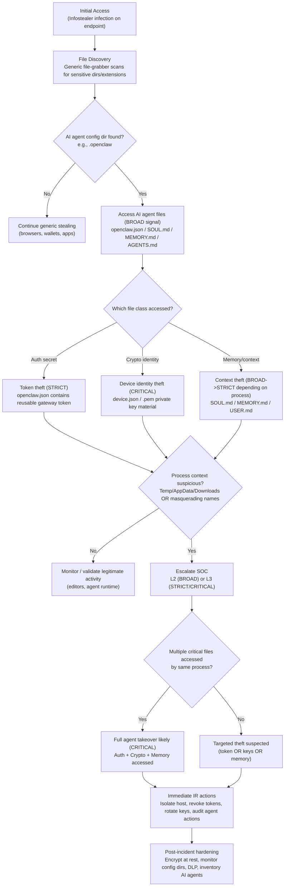

# 🧠 AI Agent Context Theft – Attack Flow 
👉🏾 [**French version available here**](README_FR.md)

```mermaid
flowchart TD
  A["Initial Access\n(Infostealer infection on endpoint)"] --> B["File Discovery\nGeneric file-grabber scans for sensitive dirs/extensions"]
  B --> C{"AI agent config dir found?\ne.g., .openclaw"}
  C -- No --> Z["Continue generic stealing\n(browsers, wallets, apps)"]
  C -- Yes --> D["Access AI agent files (BROAD signal)\nopenclaw.json / SOUL.md / MEMORY.md / AGENTS.md"]
  D --> E{"Which file class accessed?"}
  E -- Auth secret --> F["Token theft (STRICT)\nopenclaw.json contains reusable gateway token"]
  E -- Crypto identity --> G["Device identity theft (CRITICAL)\ndevice.json / .pem private key material"]
  E -- Memory/context --> H["Context theft (BROAD->STRICT depending on process)\nSOUL.md / MEMORY.md / USER.md"]
  F --> I{"Process context suspicious?\nTemp/AppData/Downloads OR masquerading names"}
  G --> I
  H --> I
  I -- No --> J["Monitor / validate legitimate activity\n(editors, agent runtime)"]
  I -- Yes --> K["Escalate SOC\nL2 (BROAD) or L3 (STRICT/CRITICAL)"]
  K --> L{"Multiple critical files accessed\nby same process?"}
  L -- Yes --> M["Full agent takeover likely (CRITICAL)\nAuth + Crypto + Memory accessed"]
  L -- No --> N["Targeted theft suspected\n(token OR keys OR memory)"]
  M --> O["Immediate IR actions\nIsolate host, revoke tokens, rotate keys, audit agent actions"]
  N --> O
  O --> P["Post-incident hardening\nEncrypt at rest, monitor config dirs, DLP, inventory AI agents"]

```
