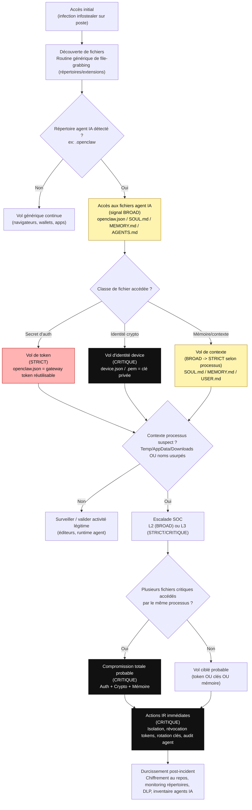

# 🧠 Vol de Contexte d’Agent IA – Schéma d’attaque 

👉🏾 [**French version available here**](README_FR.md)

```mermaid
flowchart TD
  A["Accès initial\n(infection infostealer sur poste)"] --> B["Découverte de fichiers\nRoutine générique de file-grabbing (répertoires/extensions)"]
  B --> C{"Répertoire agent IA détecté ?\nex: .openclaw"}
  C -- Non --> Z["Vol générique continue\n(navigateurs, wallets, apps)"]
  C -- Oui --> D["Accès aux fichiers agent IA\n(signal BROAD)\nopenclaw.json / SOUL.md / MEMORY.md / AGENTS.md"]
  D --> E{"Classe de fichier accédée ?"}
  E -- Secret d'auth --> F["Vol de token\n(STRICT)\nopenclaw.json = gateway token réutilisable"]
  E -- Identité crypto --> G["Vol d'identité device\n(CRITIQUE)\ndevice.json / .pem = clé privée"]
  E -- Mémoire/contexte --> H["Vol de contexte\n(BROAD -> STRICT selon processus)\nSOUL.md / MEMORY.md / USER.md"]
  F --> I{"Contexte processus suspect ?\nTemp/AppData/Downloads OU noms usurpés"}
  G --> I
  H --> I
  I -- Non --> J["Surveiller / valider activité légitime\n(éditeurs, runtime agent)"]
  I -- Oui --> K["Escalade SOC\nL2 (BROAD) ou L3 (STRICT/CRITIQUE)"]
  K --> L{"Plusieurs fichiers critiques accédés\npar le même processus ?"}
  L -- Oui --> M["Compromission totale probable\n(CRITIQUE)\nAuth + Crypto + Mémoire"]
  L -- Non --> N["Vol ciblé probable\n(token OU clés OU mémoire)"]
  M --> O["Actions IR immédiates\n(CRITIQUE)\nIsolation, révocation tokens, rotation clés, audit agent"]
  N --> O
  O --> P["Durcissement post-incident\nChiffrement au repos, monitoring répertoires, DLP, inventaire agents IA"]

  %% Style (compatible GitHub)
  classDef broad fill:#fff3b0,stroke:#a67c00,stroke-width:1px,color:#111;
  classDef strict fill:#ffb3b3,stroke:#b30000,stroke-width:1px,color:#111;
  classDef critical fill:#111,stroke:#111,stroke-width:1px,color:#fff;

  class D,H broad;
  class F strict;
  class G,M,O critical;

```
