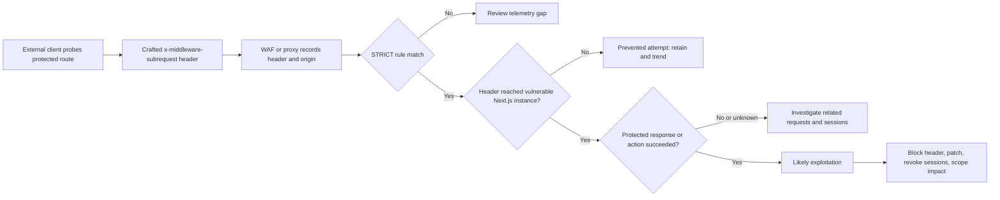

# Detection and Response Flow - CVE-2025-29927

[Français](./README_FR.md)

```mermaid
flowchart LR
    A[External client probes protected route] --> B[Crafted x-middleware-subrequest header]
    B --> C[WAF or proxy records header and origin]
    C --> D{STRICT rule match}
    D -->|No| E[Review telemetry gap]
    D -->|Yes| F{Header reached vulnerable Next.js instance?}
    F -->|No| G[Prevented attempt: retain and trend]
    F -->|Yes| H{Protected response or action succeeded?}
    H -->|No or unknown| I[Investigate related requests and sessions]
    H -->|Yes| J[Likely exploitation]
    J --> K[Block header, patch, revoke sessions, scope impact]
```
