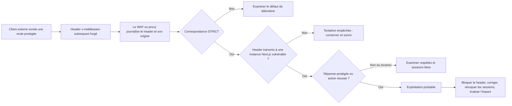

# Flux de détection et de réponse - CVE-2025-29927

[English](./README.md)

```mermaid
flowchart LR
    A[Client externe sonde une route protégée] --> B[Header x-middleware-subrequest forgé]
    B --> C[Le WAF ou proxy journalise le header et son origine]
    C --> D{Correspondance STRICT}
    D -->|Non| E[Examiner le défaut de télémétrie]
    D -->|Oui| F{Header transmis à une instance Next.js vulnérable ?}
    F -->|Non| G[Tentative empêchée : conserver et suivre]
    F -->|Oui| H{Réponse protégée ou action réussie ?}
    H -->|Non ou inconnu| I[Examiner requêtes et sessions liées]
    H -->|Oui| J[Exploitation probable]
    J --> K[Bloquer le header, corriger, révoquer les sessions, évaluer l'impact]
```
