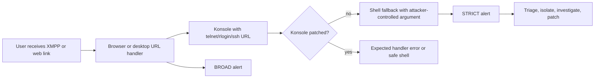

```mermaid
flowchart LR
  A[User receives XMPP or web link] --> B[Browser or desktop URL handler]
  B --> C[Konsole with telnet/rlogin/ssh URL]
  C --> D{Konsole patched?}
  D -- no --> E[Shell fallback with attacker-controlled argument]
  D -- yes --> F[Expected handler error or safe shell]
  B --> G[BROAD alert]
  E --> H[STRICT alert]
  H --> I[Triage, isolate, investigate, patch]
```
