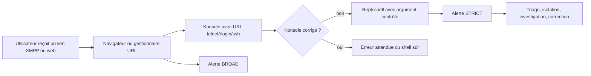

```mermaid
flowchart LR
  A[Utilisateur reçoit un lien XMPP ou web] --> B[Navigateur ou gestionnaire URL]
  B --> C[Konsole avec URL telnet/rlogin/ssh]
  C --> D{Konsole corrigé ?}
  D -- non --> E[Repli shell avec argument contrôlé]
  D -- oui --> F[Erreur attendue ou shell sûr]
  B --> G[Alerte BROAD]
  E --> H[Alerte STRICT]
  H --> I[Triage, isolation, investigation, correction]
```
