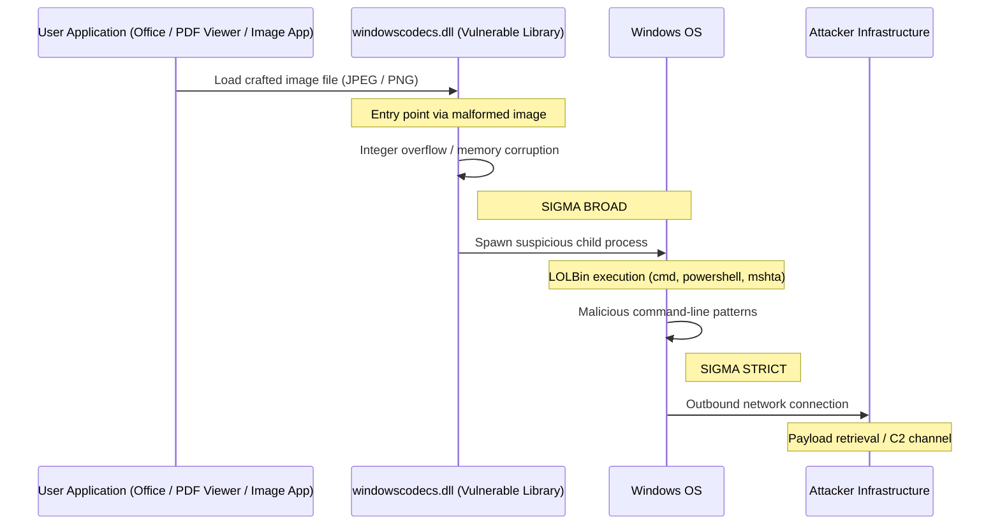

## CVE-2025-50165 – Attack to Detection Flow 
👉🏾 [French version available here](README_FR.md)

```mermaid
sequenceDiagram
    participant App as User Application (Office / PDF Viewer / Image App)
    participant DLL as windowscodecs.dll (Vulnerable Library)
    participant OS as Windows OS
    participant C2 as Attacker Infrastructure

    App->>DLL: Load crafted image file (JPEG / PNG)
    Note over DLL: Entry point via malformed image

    DLL->>DLL: Integer overflow / memory corruption
    Note right of DLL: SIGMA BROAD

    DLL->>OS: Spawn suspicious child process
    Note over OS: LOLBin execution (cmd, powershell, mshta)

    OS->>OS: Malicious command-line patterns
    Note right of OS: SIGMA STRICT

    OS->>C2: Outbound network connection
    Note over C2: Payload retrieval / C2 channel
```

