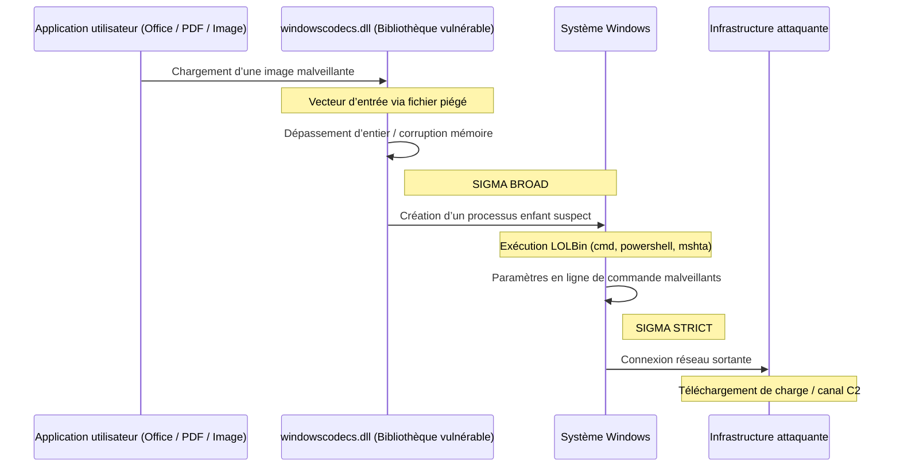

## CVE-2025-50165 – Chaîne d’attaque et détection 
👉🏾 [English version available here](README.md)

```mermaid
sequenceDiagram
    participant App as Application utilisateur (Office / PDF / Image)
    participant DLL as windowscodecs.dll (Bibliothèque vulnérable)
    participant OS as Système Windows
    participant C2 as Infrastructure attaquante

    App->>DLL: Chargement d’une image malveillante
    Note over DLL: Vecteur d’entrée via fichier piégé

    DLL->>DLL: Dépassement d’entier / corruption mémoire
    Note right of DLL: SIGMA BROAD

    DLL->>OS: Création d’un processus enfant suspect
    Note over OS: Exécution LOLBin (cmd, powershell, mshta)

    OS->>OS: Paramètres en ligne de commande malveillants
    Note right of OS: SIGMA STRICT

    OS->>C2: Connexion réseau sortante
    Note over C2: Téléchargement de charge / canal C2
```

