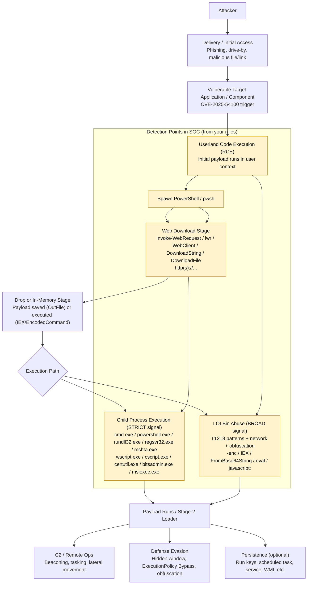

# 🧭 Attack Flow Diagrams – CVE-2025-54100

[👉🾠**French version available here**](./README_FR.md)

```mermaid
flowchart TD
  A["Attacker"] --> B["Delivery / Initial Access\nPhishing, drive-by, malicious file/link"]
  B --> C["Vulnerable Target Application / Component\nCVE-2025-54100 trigger"]
  C --> D["Userland Code Execution (RCE)\nInitial payload runs in user context"]

  %% Post-exploitation chain reflected by your Sigma rules
  D --> E["Spawn PowerShell / pwsh"]
  E --> F["Web Download Stage\nInvoke-WebRequest / iwr / WebClient / DownloadString / DownloadFile\nhttp(s)://..."]
  F --> G["Drop or In-Memory Stage\nPayload saved (OutFile) or executed (IEX/EncodedCommand)"]

  %% Execution via LOLBins / child process abuse
  G --> H{Execution Path}
  H --> I["Child Process Execution (STRICT signal)\ncmd.exe / powershell.exe / rundll32.exe / regsvr32.exe / mshta.exe\nwscript.exe / cscript.exe / certutil.exe / bitsadmin.exe / msiexec.exe"]
  H --> J["LOLBin Abuse (BROAD signal)\nT1218 patterns + network + obfuscation\n-enc / IEX / FromBase64String / eval / javascript:"]

  %% Outcomes
  I --> K["Payload Runs / Stage-2 Loader"]
  J --> K
  K --> L["C2 / Remote Ops\nBeaconing, tasking, lateral movement"]
  K --> M["Defense Evasion\nHidden window, ExecutionPolicy Bypass, obfuscation"]
  K --> N["Persistence (optional)\nRun keys, scheduled task, service, WMI, etc."]

  %% SOC detection points
  subgraph SOC_Detections["Detection Points in SOC (from your rules)"]
    E:::det --> F:::det
    F:::det --> I:::det
    D:::det --> J:::det
  end

  classDef det fill:#fff3cd,stroke:#c08a00,stroke-width:1px,color:#111;
```

