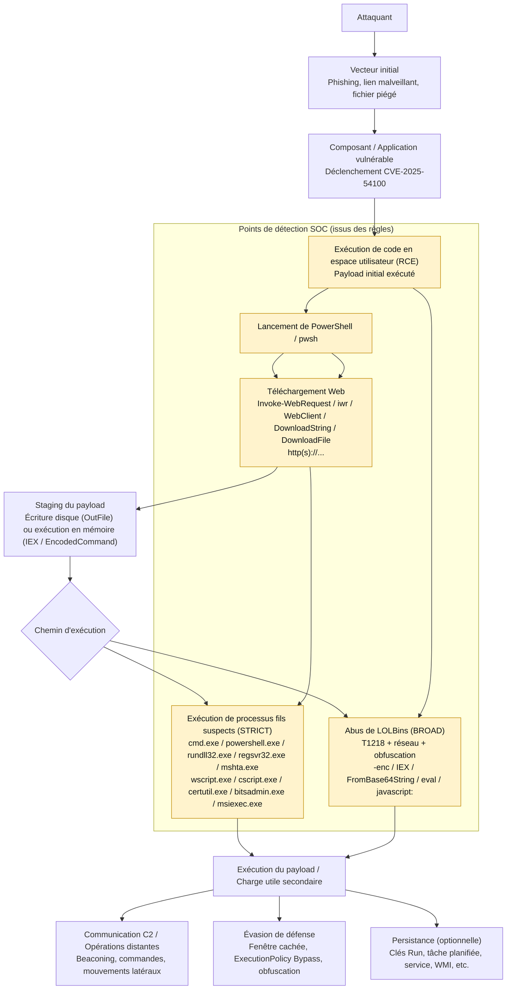

# 🧭 Diagrammes de la chaîne d’exploitation – CVE-2025-54100

[👉🏾 **English version available here**](./README.md)

```mermaid
flowchart TD
  A["Attaquant"] --> B["Vecteur initial\nPhishing, lien malveillant, fichier piégé"]
  B --> C["Composant / Application vulnérable\nDéclenchement CVE-2025-54100"]
  C --> D["Exécution de code en espace utilisateur (RCE)\nPayload initial exécuté"]

  %% Chaîne post-exploitation observée par les règles Sigma
  D --> E["Lancement de PowerShell / pwsh"]
  E --> F["Téléchargement Web\nInvoke-WebRequest / iwr / WebClient / DownloadString / DownloadFile\nhttp(s)://..."]
  F --> G["Staging du payload\nÉcriture disque (OutFile) ou exécution en mémoire (IEX / EncodedCommand)"]

  %% Abus de LOLBins / processus fils
  G --> H{Chemin d'exécution}
  H --> I["Exécution de processus fils suspects (STRICT)\ncmd.exe / powershell.exe / rundll32.exe / regsvr32.exe / mshta.exe\nwscript.exe / cscript.exe / certutil.exe / bitsadmin.exe / msiexec.exe"]
  H --> J["Abus de LOLBins (BROAD)\nT1218 + réseau + obfuscation\n-enc / IEX / FromBase64String / eval / javascript:"]

  %% Effets post-exploitation
  I --> K["Exécution du payload / Charge utile secondaire"]
  J --> K
  K --> L["Communication C2 / Opérations distantes\nBeaconing, commandes, mouvements latéraux"]
  K --> M["Évasion de défense\nFenêtre cachée, ExecutionPolicy Bypass, obfuscation"]
  K --> N["Persistance (optionnelle)\nClés Run, tâche planifiée, service, WMI, etc."]

  %% Points de détection SOC
  subgraph SOC_Detections["Points de détection SOC (issus des règles)"]
    E:::det --> F:::det
    F:::det --> I:::det
    D:::det --> J:::det
  end

  classDef det fill:#fff3cd,stroke:#c08a00,stroke-width:1px,color:#111;

```
