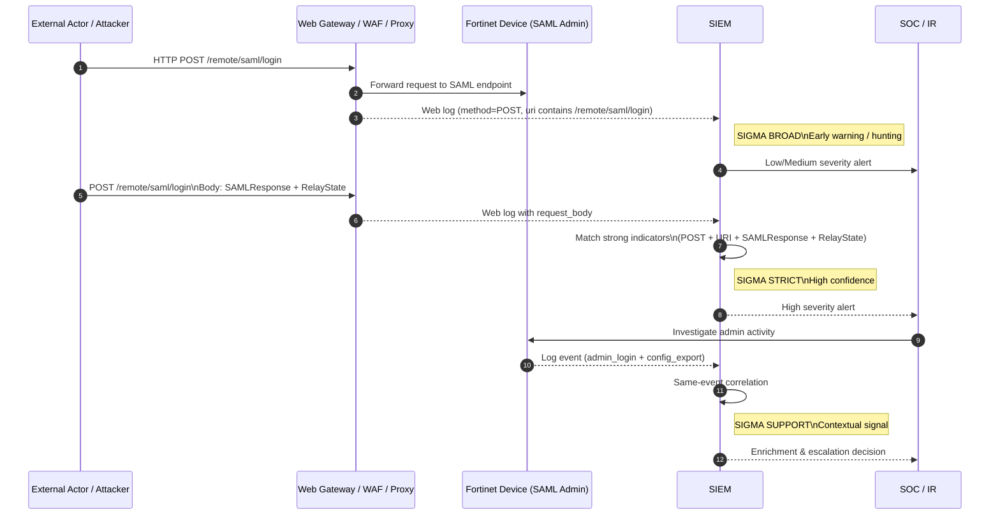

➡️ [French version available here](README_FR.md)
# CVE-2025-59718 - Fortinet FortiCloud SSO Authentication Bypass

```mermaid
sequenceDiagram
    autonumber
    participant A as External Actor / Attacker
    participant W as Web Gateway / WAF / Proxy
    participant F as Fortinet Device (SAML Admin)
    participant SIEM as SIEM
    participant SOC as SOC / IR

    %% BROAD – Early warning / Hunting
    A->>W: HTTP POST /remote/saml/login
    W->>F: Forward request to SAML endpoint
    W-->>SIEM: Web log (method=POST, uri contains /remote/saml/login)
    Note right of SIEM: SIGMA BROAD\nEarly warning / hunting
    SIEM->>SOC: Low/Medium severity alert

    %% STRICT – High confidence exploitation
    A->>W: POST /remote/saml/login\nBody: SAMLResponse + RelayState
    W-->>SIEM: Web log with request_body
    SIEM->>SIEM: Match strong indicators\n(POST + URI + SAMLResponse + RelayState)
    Note right of SIEM: SIGMA STRICT\nHigh confidence
    SIEM-->>SOC: High severity alert

    %% SUPPORT – Contextual confirmation
    SOC->>F: Investigate admin activity
    F-->>SIEM: Log event (admin_login + config_export)
    SIEM->>SIEM: Same-event correlation
    Note right of SIEM: SIGMA SUPPORT\nContextual signal
    SIEM-->>SOC: Enrichment & escalation decision
```

