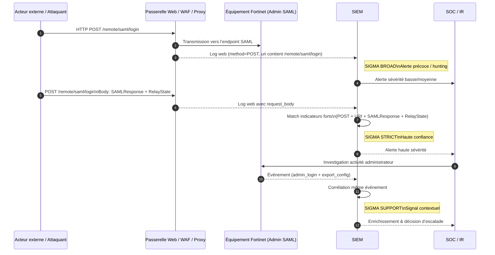

➡️ [English version available here](README.md)
# CVE-2025-59718 - Fortinet FortiCloud SSO Authentication Bypass

```mermaid
sequenceDiagram
    autonumber
    participant A as Acteur externe / Attaquant
    participant W as Passerelle Web / WAF / Proxy
    participant F as Équipement Fortinet (Admin SAML)
    participant SIEM as SIEM
    participant SOC as SOC / IR

    %% BROAD – Alerte précoce / Hunting
    A->>W: HTTP POST /remote/saml/login
    W->>F: Transmission vers l’endpoint SAML
    W-->>SIEM: Log web (method=POST, uri contient /remote/saml/login)
    Note right of SIEM: SIGMA BROAD\nAlerte précoce / hunting
    SIEM->>SOC: Alerte sévérité basse/moyenne

    %% STRICT – Exploitation à forte confiance
    A->>W: POST /remote/saml/login\nBody: SAMLResponse + RelayState
    W-->>SIEM: Log web avec request_body
    SIEM->>SIEM: Match indicateurs forts\n(POST + URI + SAMLResponse + RelayState)
    Note right of SIEM: SIGMA STRICT\nHaute confiance
    SIEM-->>SOC: Alerte haute sévérité

    %% SUPPORT – Confirmation contextuelle
    SOC->>F: Investigation activité administrateur
    F-->>SIEM: Événement (admin_login + export_config)
    SIEM->>SIEM: Corrélation même événement
    Note right of SIEM: SIGMA SUPPORT\nSignal contextuel
    SIEM-->>SOC: Enrichissement & décision d’escalade
```

