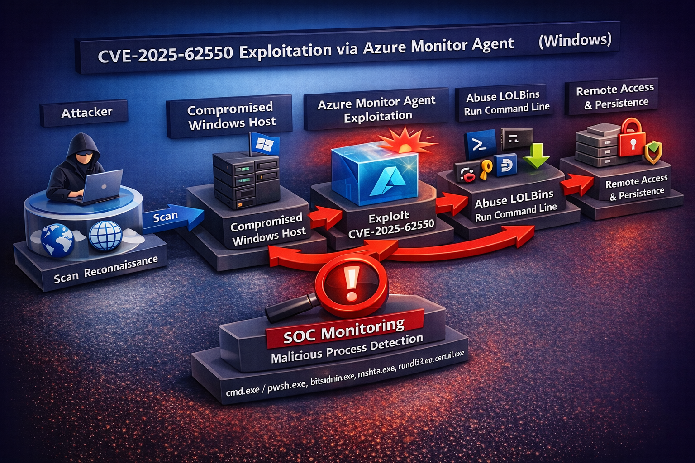

# Diagram Attack → Detection → Response (CVE-2025-62550)

[👉🏾 **French version available here**](./README_FR.md)

## 📊 Attack Flow Diagram (Mermaid)
```mermaid
flowchart TD
  A[External Attacker / Initial Access] --> B{Target has Azure Monitor Agent (AMA)?}
  B -- No --> Z[Not in scope]
  B -- Yes --> C[Exploit CVE-2025-62550\nPre-auth / Agent abuse]
  C --> D[AMA Parent Process\n(Azure Monitor Agent binary)]
  D --> E[Spawn Child Process\n(rare / anomalous)]
  E --> F{Child is LOLBin / Scripting Tool?}
  F -- No --> G[Other suspicious child activity\n(e.g., reg/sc/schtasks/ssh)]
  F -- Yes --> H[LOLBin Execution\npowershell/cmd/mshta/rundll32/regsvr32/wscript]
  H --> I[Malicious Command Line Patterns]
  I --> I1[Obfuscation\n-enc / FromBase64String / hidden / bypass]
  I --> I2[Ingress Tool Transfer\nIWR/curl/wget/bitsadmin/certutil + URL]
  I2 --> J[Payload Downloaded\n.exe/.dll/.ps1/.js/.vbs]
  J --> K[Execution / Persistence\nschtasks / reg add / sc create]
  K --> L[Post-Exploitation\nLateral movement / data access]

  %% Detection Mapping
  E -. BROAD Rule .-> M[BROAD: Anomalous AMA Child Process\n(rare parent-child + light CLI suspicion)]
  H -. STRICT Rule .-> N[STRICT: AMA -> LOLBin + strong malicious CLI\n(download/execute + obfuscation)]

  %% SOC Actions
  N --> O[High-Confidence Alert\nContainment + IR]
  M --> P[Hunting / Triage\nValidate legitimacy + tune allow-list]
```



