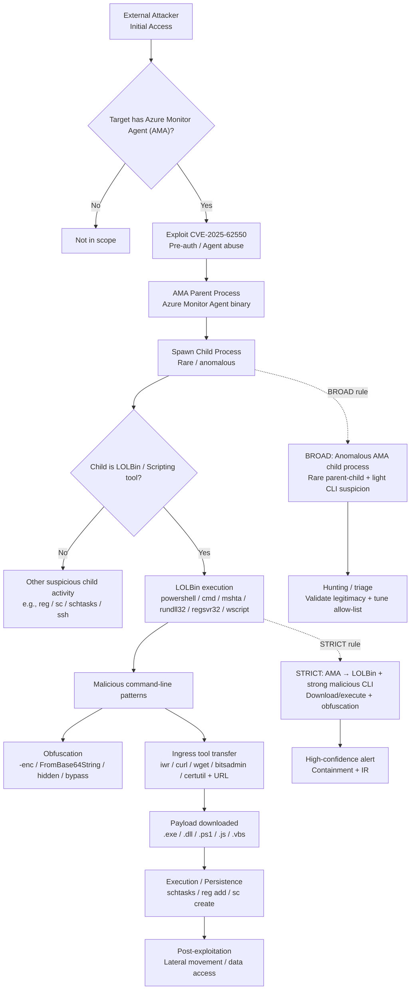

# Diagram Attack → Detection → Response (CVE-2025-62550)

[👉🏾 **French version available here**](./README_FR.md)

## 📊 Attack Flow Diagram (Mermaid)

```mermaid
flowchart TD
  A["External Attacker<br/>Initial Access"] --> B{"Target has Azure Monitor Agent (AMA)?"}
  B -- "No" --> Z["Not in scope"]
  B -- "Yes" --> C["Exploit CVE-2025-62550<br/>Pre-auth / Agent abuse"]
  C --> D["AMA Parent Process<br/>Azure Monitor Agent binary"]
  D --> E["Spawn Child Process<br/>Rare / anomalous"]
  E --> F{"Child is LOLBin / Scripting tool?"}
  F -- "No" --> G["Other suspicious child activity<br/>e.g., reg / sc / schtasks / ssh"]
  F -- "Yes" --> H["LOLBin execution<br/>powershell / cmd / mshta / rundll32 / regsvr32 / wscript"]
  H --> I["Malicious command-line patterns"]
  I --> I1["Obfuscation<br/>-enc / FromBase64String / hidden / bypass"]
  I --> I2["Ingress tool transfer<br/>iwr / curl / wget / bitsadmin / certutil + URL"]
  I2 --> J["Payload downloaded<br/>.exe / .dll / .ps1 / .js / .vbs"]
  J --> K["Execution / Persistence<br/>schtasks / reg add / sc create"]
  K --> L["Post-exploitation<br/>Lateral movement / data access"]

  E -. "BROAD rule" .-> M["BROAD: Anomalous AMA child process<br/>Rare parent-child + light CLI suspicion"]
  H -. "STRICT rule" .-> N["STRICT: AMA → LOLBin + strong malicious CLI<br/>Download/execute + obfuscation"]

  N --> O["High-confidence alert<br/>Containment + IR"]
  M --> P["Hunting / triage<br/>Validate legitimacy + tune allow-list"]
```

