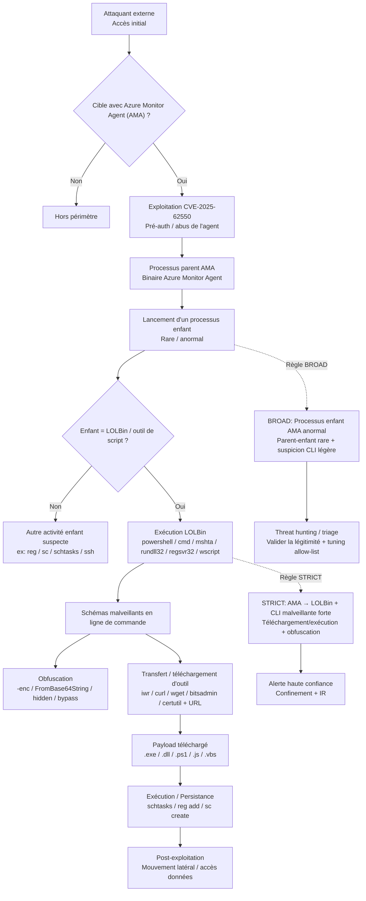

# Diagramme Attack → Detection → Response (CVE-2025-62550)

[👉🏾 **English version available here**](./README.md)

## 📊 Attack Flow Diagram (Mermaid)

```mermaid
flowchart TD
  A["Attaquant externe<br/>Accès initial"] --> B{"Cible avec Azure Monitor Agent (AMA) ?"}
  B -- "Non" --> Z["Hors périmètre"]
  B -- "Oui" --> C["Exploitation CVE-2025-62550<br/>Pré-auth / abus de l'agent"]
  C --> D["Processus parent AMA<br/>Binaire Azure Monitor Agent"]
  D --> E["Lancement d'un processus enfant<br/>Rare / anormal"]
  E --> F{"Enfant = LOLBin / outil de script ?"}
  F -- "Non" --> G["Autre activité enfant suspecte<br/>ex: reg / sc / schtasks / ssh"]
  F -- "Oui" --> H["Exécution LOLBin<br/>powershell / cmd / mshta / rundll32 / regsvr32 / wscript"]
  H --> I["Schémas malveillants en ligne de commande"]
  I --> I1["Obfuscation<br/>-enc / FromBase64String / hidden / bypass"]
  I --> I2["Transfert / téléchargement d'outil<br/>iwr / curl / wget / bitsadmin / certutil + URL"]
  I2 --> J["Payload téléchargé<br/>.exe / .dll / .ps1 / .js / .vbs"]
  J --> K["Exécution / Persistance<br/>schtasks / reg add / sc create"]
  K --> L["Post-exploitation<br/>Mouvement latéral / accès données"]

  E -. "Règle BROAD" .-> M["BROAD: Processus enfant AMA anormal<br/>Parent-enfant rare + suspicion CLI légère"]
  H -. "Règle STRICT" .-> N["STRICT: AMA → LOLBin + CLI malveillante forte<br/>Téléchargement/exécution + obfuscation"]

  N --> O["Alerte haute confiance<br/>Confinement + IR"]
  M --> P["Threat hunting / triage<br/>Valider la légitimité + tuning allow-list"]
```

