## 🛡️ CVE-2025-68947 - BYOVD Detection (BROAD vs STRICT)

[👉🏾 **French version available here**](README_FR.md)

**Scenario:** Black Basta ransomware abusing BYOVD via a vulnerable kernel driver (NSecKrnl.sys)  
**Goal:** Detect defense evasion activity *before* ransomware encryption

```mermaid
flowchart TD
  %% GitHub-compatible Mermaid (no HTML tags in labels)

  classDef broad fill:#FFF3BF,stroke:#F08C00,stroke-width:2px,color:#5C3A00;
  classDef strict fill:#FFE3E3,stroke:#C92A2A,stroke-width:2px,color:#5A1A1A;
  classDef decision fill:#E7F5FF,stroke:#1C7ED6,stroke-width:2px,color:#0B3B66;
  classDef action fill:#E6FCF5,stroke:#12B886,stroke-width:2px,color:#064D3B;
  classDef note fill:#F1F3F5,stroke:#868E96,stroke-dasharray: 5 3,color:#343A40;

  H1["CVE-2025-68947\nBYOVD Driver Abuse\n(NSecKrnl.sys)"]:::note
  H2["Goal: detect defense evasion\nbefore ransomware impact"]:::note
  H1 --> H2

  subgraph S0["Threat Scenario"]
    direction TB
    S0A["Load vulnerable driver\nNSecKrnl.sys"]:::note
    S0B["Kernel-level access via BYOVD"]:::note
    S0C["Security tools terminated/stopped"]:::note
    S0D["Potential ransomware execution"]:::note
    S0A --> S0B --> S0C --> S0D
  end
  H2 --> S0A

  subgraph S1["BROAD — Early Warning / Hunting"]
    direction TB
    B1["Sysmon EID 6\nDriver Load"]:::broad
    B2["Match: ImageLoaded endswith\n\\NSecKrnl.sys"]:::broad
    B3["Path heuristic: contains\n\\Temp\\ or \\ProgramData\\ or \\Users\\"]:::broad
    B4["BROAD Alert: suspicious driver load"]:::broad
    B1 --> B2 --> B3 --> B4
  end

  subgraph S2["STRICT — High Confidence"]
    direction TB
    D1{"Defense evasion observed\nafter driver load?"}:::decision
    S2A["Security tool termination/stop\n(EDR/AV processes/services)"]:::strict
    S2B["STRICT Alert: BYOVD + kill security"]:::strict
    D1 -->|Yes| S2A --> S2B
  end

  subgraph S3["SOC Response"]
    direction TB
    A1["Isolate host"]:::action
    A2["Collect artifacts\n(driver path/hash, parent process, user)"]:::action
    A3["Hunt lateral movement & persistence"]:::action
    A4["Trigger IR playbook (pre-ransomware)"]:::action
    A1 --> A2 --> A3 --> A4
  end

  S0C --> B1
  B4 --> D1
  D1 -->|No| T1["Hunting / Triage\nValidate legitimacy and increase monitoring"]:::note
  S2B --> S3
```

