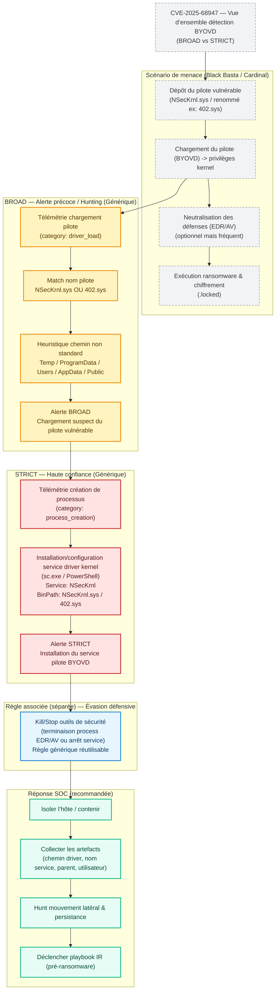

## 🛡️ CVE-2025-68947 - Détection BYOVD (BROAD vs STRICT)

[👉🏾 **English version available here**](README.md)

**Scénario :** Campagne ransomware Black Basta exploitant BYOVD via le pilote vulnérable NSecKrnl.sys  
**Objectif :** Détecter l’évasion défensive *avant* le chiffrement ransomware

