## 🛡️ CVE-2025-68947 - Détection BYOVD (BROAD vs STRICT)

[👉🏾 **English version available here**](README.md)

**Scénario :** Campagne ransomware Black Basta exploitant BYOVD via le pilote vulnérable NSecKrnl.sys  
**Objectif :** Détecter l’évasion défensive *avant* le chiffrement ransomware

```mermaid
flowchart TD
  %% Mermaid compatible GitHub (pas de tags HTML dans les labels)

  classDef broad fill:#FFF3BF,stroke:#F08C00,stroke-width:2px,color:#5C3A00;
  classDef strict fill:#FFE3E3,stroke:#C92A2A,stroke-width:2px,color:#5A1A1A;
  classDef decision fill:#E7F5FF,stroke:#1C7ED6,stroke-width:2px,color:#0B3B66;
  classDef action fill:#E6FCF5,stroke:#12B886,stroke-width:2px,color:#064D3B;
  classDef note fill:#F1F3F5,stroke:#868E96,stroke-dasharray: 5 3,color:#343A40;

  H1["CVE-2025-68947\nAbus BYOVD\n(NSecKrnl.sys)"]:::note
  H2["Objectif : détecter l’évasion défensive\navant l’impact ransomware"]:::note
  H1 --> H2

  subgraph S0["Scénario de menace"]
    direction TB
    S0A["Chargement du pilote vulnérable\nNSecKrnl.sys"]:::note
    S0B["Accès noyau via BYOVD"]:::note
    S0C["Neutralisation EDR / AV"]:::note
    S0D["Exécution ransomware possible"]:::note
    S0A --> S0B --> S0C --> S0D
  end
  H2 --> S0A

  subgraph S1["BROAD — Alerte précoce / Hunting"]
    direction TB
    B1["Sysmon EID 6\nChargement pilote"]:::broad
    B2["Match : ImageLoaded se termine par\n\\NSecKrnl.sys"]:::broad
    B3["Heuristique chemin : contient\n\\Temp\\ ou \\ProgramData\\ ou \\Users\\"]:::broad
    B4["Alerte BROAD : chargement suspect"]:::broad
    B1 --> B2 --> B3 --> B4
  end

  subgraph S2["STRICT — Haute confiance"]
    direction TB
    D1{"Évasion défensive observée\naprès le chargement ?"}:::decision
    S2A["Arrêt / terminaison d’outils de sécurité\n(process/services EDR/AV)"]:::strict
    S2B["Alerte STRICT : BYOVD + kill sécurité"]:::strict
    D1 -->|Oui| S2A --> S2B
  end

  subgraph S3["Réponse SOC"]
    direction TB
    A1["Isoler l’hôte"]:::action
    A2["Collecter les artefacts\n(chemin/hash driver, processus parent, utilisateur)"]:::action
    A3["Rechercher mouvement latéral & persistance"]:::action
    A4["Déclencher le playbook IR (pré-ransomware)"]:::action
    A1 --> A2 --> A3 --> A4
  end

  S0C --> B1
  B4 --> D1
  D1 -->|Non| T1["Hunting / Triage\nValider la légitimité et renforcer la supervision"]:::note
  S2B --> S3
```

