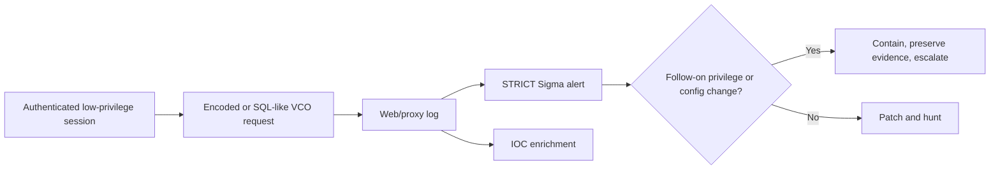

# Attack to Response Flow

[Version française](./README_FR.md)

```mermaid
flowchart LR
  A[Authenticated low-privilege session] --> B[Encoded or SQL-like VCO request]
  B --> C[Web/proxy log]
  C --> D[STRICT Sigma alert]
  D --> E{Follow-on privilege or config change?}
  E -->|Yes| F[Contain, preserve evidence, escalate]
  E -->|No| G[Patch and hunt]
  C --> H[IOC enrichment]
```
