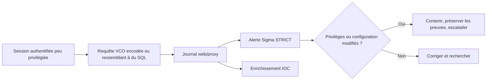

# Flux attaque vers réponse

[English version](./README.md)

```mermaid
flowchart LR
  A[Session authentifiée peu privilégiée] --> B[Requête VCO encodée ou ressemblant à du SQL]
  B --> C[Journal web/proxy]
  C --> D[Alerte Sigma STRICT]
  D --> E{Privilèges ou configuration modifiés ?}
  E -->|Oui| F[Contenir, préserver les preuves, escalader]
  E -->|Non| G[Corriger et rechercher]
  C --> H[Enrichissement IOC]
```
