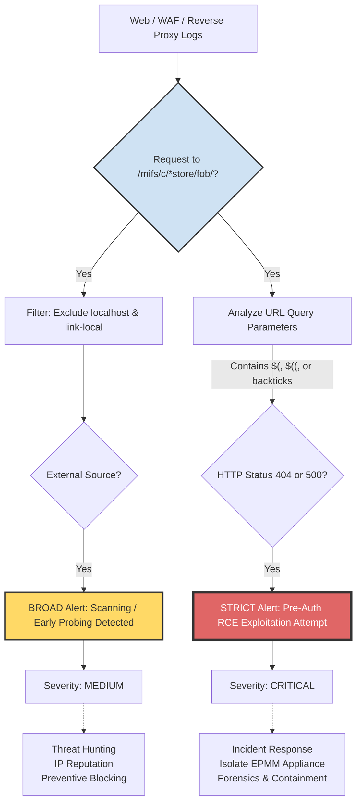

# 🧭 SOC Attack & Detection Cycle Diagram

## Flow Explanation:

Common Entry Point: Both detections begin by identifying access to the sensitive directories /mifs/c/appstore/fob/ (CVE-2026-1281) or /mifs/c/aftstore/fob/ (CVE-2026-1340).

### The BROAD Rule (Left Branch):
- It simply verifies if the access originates from the Internet (by filtering out local/internal IPs).
- It serves as a "radar" to identify attackers scanning for exposure.

### The STRICT Rule (Right Branch):
- It inspects the technical content of the request (url.query) specifically looking for Bash arithmetic expansion.
- It uses the HTTP status codes (404/500) as an anomaly confirmer, radically increasing the confidence level of the alert.

Legend

🟡 BROAD = Yellow · 🔴 STRICT = Red
[👉🏾](./ivanti_epmm_attack_flow_broad_strict.png)
