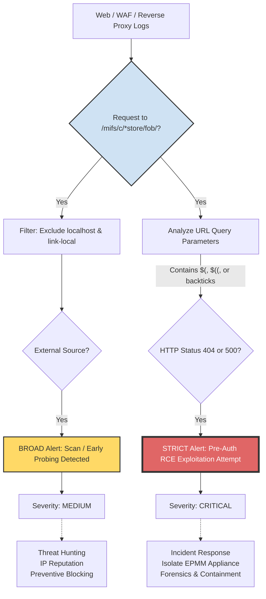
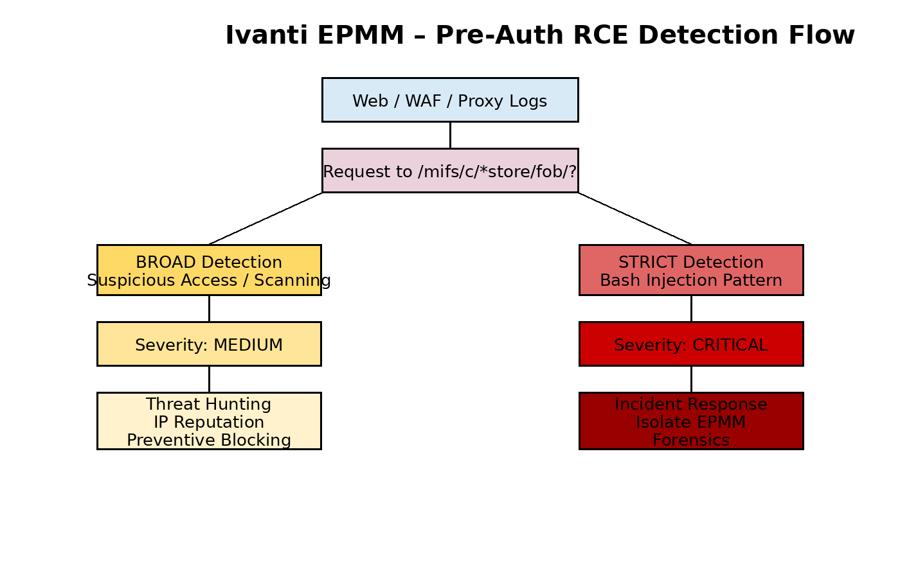

# 🧭 Diagramme – Cycle d’attaque & détection SOC  
 [👉🏾 English version available here: ](./README.md)

**Ivanti EPMM – CVE-2026-1281 / CVE-2026-1340**

---
## Explication du flux :

### Point d'entrée commun : 

Les deux détections commencent par identifier l'accès aux répertoires sensibles /mifs/c/appstore/fob/ (CVE-2026-1281) ou /mifs/c/aftstore/fob/ (CVE-2026-1340).

### La règle BROAD (Branche gauche) :
- Elle se contente de vérifier si l'accès provient d'Internet (en filtrant les IPs locales).
- Elle sert de "radar" pour identifier les attaquants qui testent votre exposition.

### La règle STRICT (Branche droite) :
- Elle examine le contenu technique de la requête (url.query) à la recherche de l'expansion arithmétique Bash.
- Elle utilise le code de statut HTTP (404/500) comme confirmateur d'anomalie, augmentant radicalement la confiance dans l'alerte.

🟡 BROAD = Jaune · 🔴 STRICT = Rouge

