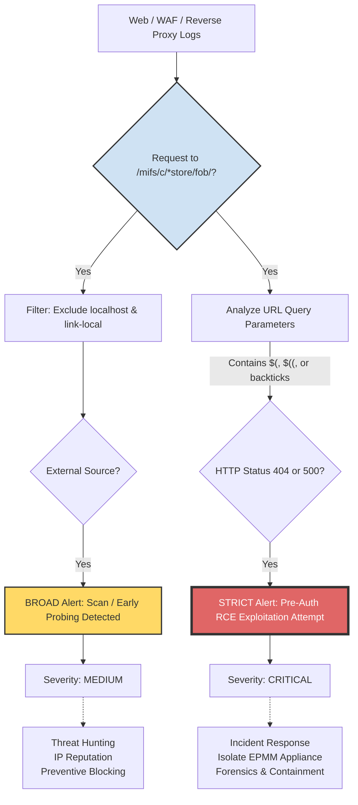

# 🧭 Diagramme – Cycle d’attaque & détection SOC

[👉🏾 English version available here](./README_IVANTI_EPMM_EN.md)

**Ivanti Endpoint Manager Mobile (EPMM)**  
**CVE-2026-1281 / CVE-2026-1340**

---

## 📊 Vue d’ensemble du flux de détection

---

## 📌 Message clé SOC

La règle **BROAD** détecte l’exposition et la reconnaissance.  
La règle **STRICT** confirme une tentative d’exploitation réelle et déclenche la réponse à incident.

---

## 🖼️ Diagramme visuel (PNG)

