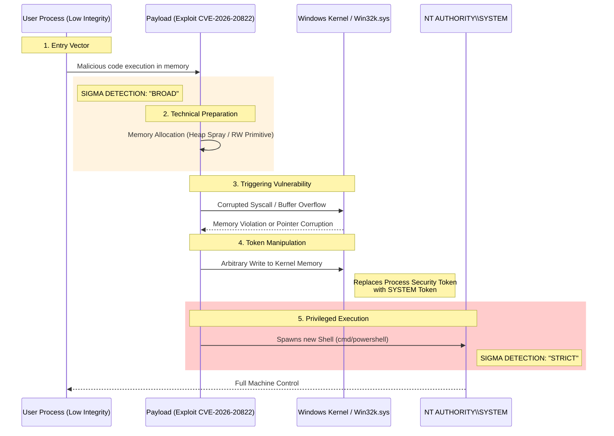
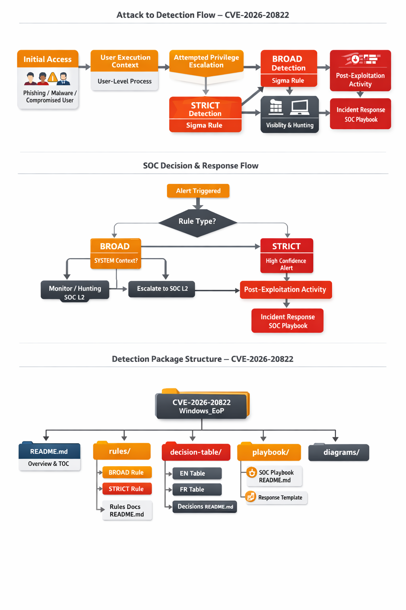

# CVE-2026-20822 – Windows Privilege Escalation Detection (Sigma)

👉🏾 **French version here**: [README_FR.md](README_FR.md)

This directory provides a **behavior-based detection package** for identifying Windows privilege escalation (EoP) activity potentially associated with **CVE-2026-20822** and similar vulnerabilities.

The detection logic focuses on **observable outcomes and behaviors**, not on a specific exploit implementation.

---

## 📊 Technical Exploitation Flow

This diagram illustrates the exploitation path and where the Sigma rules (**BROAD vs STRICT**) trigger during the attack.

---

## 🟠 Rule 1 - BROAD

- **File:** [process_creation_win_eop_cve_2026_20822_broad.yml](./rules/process_creation_win_eop_cve_2026_20822_broad.yml)
- **Objective:** Detects early-stage activity where common user applications spawn administrative or scripting binaries.

---

## 🔴 Rule 2 - STRICT

- **File:** [process_creation_win_eop_cve_2026_20822_strict.yml](./rules/process_creation_win_eop_cve_2026_20822_strict.yml)
- **Objective:** Detects with a high level of confidence a successful exploitation where a user process spawns a child with SYSTEM privileges or high integrity.

---

## 🧩 Recommended SOC Usage

- **BROAD Rule:** Use for threat hunting and visibility. It may generate false positives from power users but catches exploitation attempts early.
- **STRICT Rule:** Use for high-priority alerting. If this rule triggers, it is highly likely that the system has been compromised with administrative rights.

---

## 🔗 External Resources

- **NVD – CVE-2026-20822 Details:** https://nvd.nist.gov/vuln/detail/CVE-2026-20822
- **Microsoft Security Update Guide:** https://msrc.microsoft.com/update-guide/vulnerability/CVE-2026-20822

---

**Author**  
Adama ASSIONGBON – SOC & CTI Analyst Consultant  
[LinkedIn Profile](https://www.linkedin.com/in/adama-assiongbon-9029893a/)
