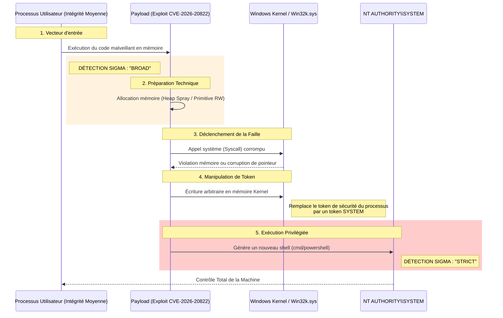
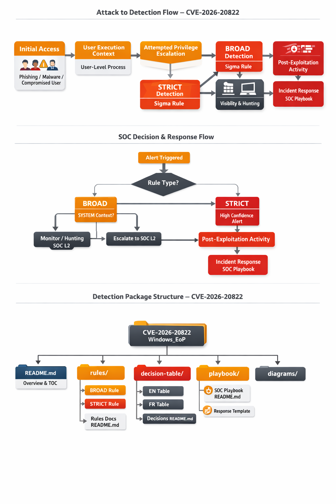

# CVE-2026-20822 – Détection d'Élévation de Privilèges Windows (Sigma)
👉🏾 [English version available here](README.md)

Ce répertoire propose un **package de détection basé sur le comportement** pour identifier les activités d'élévation de privilèges (EoP) Windows potentiellement associées à la **CVE-2026-20822**.

---

## 📊 Flux Technique de l'Exploitation

Ce diagramme illustre le chemin d'attaque et les points d'activation des règles Sigma (**BROAD vs STRICT**).

---

## 🟠 Règle 1 - BROAD (Large)

- **Fichier :** [process_creation_win_eop_cve_2026_20822_broad.yml](./rules/process_creation_win_eop_cve_2026_20822_broad.yml)
- **Objectif :** Détecte l'activité en phase initiale où des applications utilisateur courantes génèrent des outils d'administration ou de script.

---

## 🔴 Règle 2 - STRICT

- **Fichier :** [process_creation_win_eop_cve_2026_20822_strict.yml](./rules/process_creation_win_eop_cve_2026_20822_strict.yml)
- **Objectif :** Détecte avec un haut niveau de confiance une exploitation réussie où un processus utilisateur génère un enfant avec des privilèges SYSTEM ou une intégrité élevée.

---

## 🧩 Utilisation Recommandée pour le SOC

- **Règle BROAD :** À utiliser pour le threat hunting et la visibilité. Elle peut générer des faux positifs chez les utilisateurs avancés mais permet de détecter les tentatives d'exploitation très tôt.
- **Règle STRICT :** À utiliser pour l'alerte haute priorité. Si cette règle se déclenche, il est fort probable que le système soit compromis avec des droits administratifs.

---

## 🔗 Liens utiles

- **NVD – Détails CVE-2026-20822 :** https://nvd.nist.gov/vuln/detail/CVE-2026-20822
- **Microsoft Security Update Guide :** https://msrc.microsoft.com/update-guide/vulnerability/CVE-2026-20822

---

**Auteur :** Adama ASSIONGBON – Consultant Analyste SOC & CTI  
[Profil LinkedIn](https://www.linkedin.com/in/adama-assiongbon-9029893a/)
