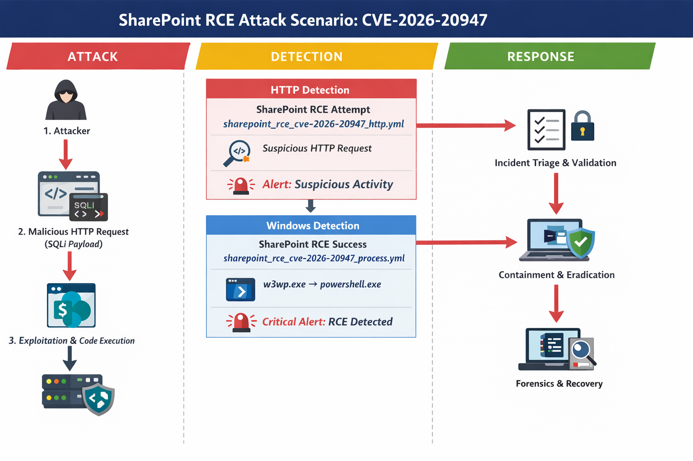

# Diagrams – CVE-2026-20947 SharePoint RCE

---

## 📌 Purpose

This directory contains visual diagrams that illustrate the **Attack → Detection → Response** workflow
for **CVE-2026-20947 (Microsoft SharePoint RCE)**.

These diagrams help SOC teams understand the attack chain, detection logic, and response flow.

---

## 🖼️ Available Diagram

### Attack_Detection_Response_Flow_CVE-2026-20947.png

**Description**
- End-to-end SharePoint RCE attack flow
- Web-layer detection (HTTP / IIS)
- Host-layer confirmation (Windows process)
- SOC response actions

**Flow**
1. Crafted HTTP requests target SharePoint
2. Hunting detection triggers on web logs
3. RCE spawns suspicious child process
4. Windows STRICT rule confirms compromise
5. SOC containment and incident response

---

## 🔗 Related Content

- Sigma rules: `../rules/`
- SOAR playbooks: `../playbook/`
- Main README: `../README.md`

