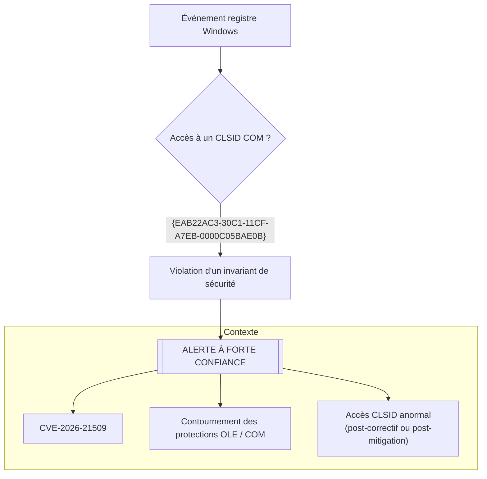

# 🛡️ CVE-2026-21509 - Détection du contournement de sécurité Microsoft Office

👉🏾 **[Version anglaise disponible ici](README.md)**

---

## Présentation

Ce dépôt propose **une règle Sigma unique à forte confiance** pour la vulnérabilité **CVE-2026-21509**, affectant Microsoft Office.

Cette faille est classée comme un **Security Feature Bypass** et permet de contourner les mécanismes de protection OLE / COM de Microsoft Office.

La détection repose sur un **invariant de sécurité fort**, explicitement documenté par Microsoft.

---

## 📑 Scénario d’attaque : de l’exploitation à la détection

Pour comprendre la logique de la règle, voici le déroulement typique d’une attaque basée sur un PoC public.

### 1. Préparation et livraison

L’attaquant génère un document Microsoft Office malveillant (par exemple `.docx`) à l’aide d’un script Python.

Ce document contient un objet **OLE** référencé par le CLSID suivant :

```
{EAB22AC3-30C1-11CF-A7EB-0000C05BAE0B}
```

Ce CLSID est **explicitement mentionné dans les avis de sécurité Microsoft** relatifs à CVE-2026-21509.

Le document est ensuite transmis à la victime, généralement via une campagne de **phishing**.

---

### 2. Exécution (exploitation)

Lorsque la victime ouvre le document :

- En fonctionnement normal, Microsoft Office devrait bloquer l’instanciation ou afficher une alerte de sécurité.
- En exploitant **CVE-2026-21509**, le document force l’instanciation du composant COM **sans déclencher les protections attendues**.

Il s’agit donc d’un **contournement de mécanisme de sécurité**.

---

### 3. Trace système observable (point de détection)

Pour instancier un objet COM, **Windows doit interroger le Registre** afin de résoudre le CLSID.

Cela génère un accès à la clé suivante :

```
HKCR\CLSID\{EAB22AC3-30C1-11CF-A7EB-0000C05BAE0B}
```

📌 **C’est précisément ce comportement que la règle Sigma surveille.**

Sur un système :
- corrigé,
- ou correctement mitigé (kill-bit COM appliqué),

👉🏾 **tout accès à ce CLSID constitue une anomalie critique**, quel que soit le processus à l’origine de la requête.

---

## 🎯 Pourquoi cette approche est robuste

- Le CLSID est **explicitement nommé par Microsoft**
- Il est **directement lié à la vulnérabilité**
- Il est **bloqué après correctif**
- Son accès viole un **invariant de sécurité**

➡️ La détection est :
- simple
- portable
- à forte confiance
- indépendante des noms de processus

---

## Résumé SOC

| Élément | Valeur |
|---|---|
| Vulnérabilité | CVE-2026-21509 |
| Type | Security Feature Bypass |
| Signal détecté | Accès au CLSID vulnérable |
| Source de logs | Registre Windows |
| Dépendance au processus | Non |
| Niveau d’alerte | Élevé |

---
## Logique de détection (Diagramme final)


---
## Références

- Avis Microsoft : https://msrc.microsoft.com/update-guide/vulnerability/CVE-2026-21509
- NVD : https://nvd.nist.gov/vuln/detail/CVE-2026-21509
- PoC public : https://github.com/Ashwesker/Ashwesker-CVE-2026-21509

---

Auteur : **Adama ASSIONGBON** -Consultant SOC & CTI
[LinkedIn Profile](https://www.linkedin.com/in/adama-assiongbon-9029893a/)
