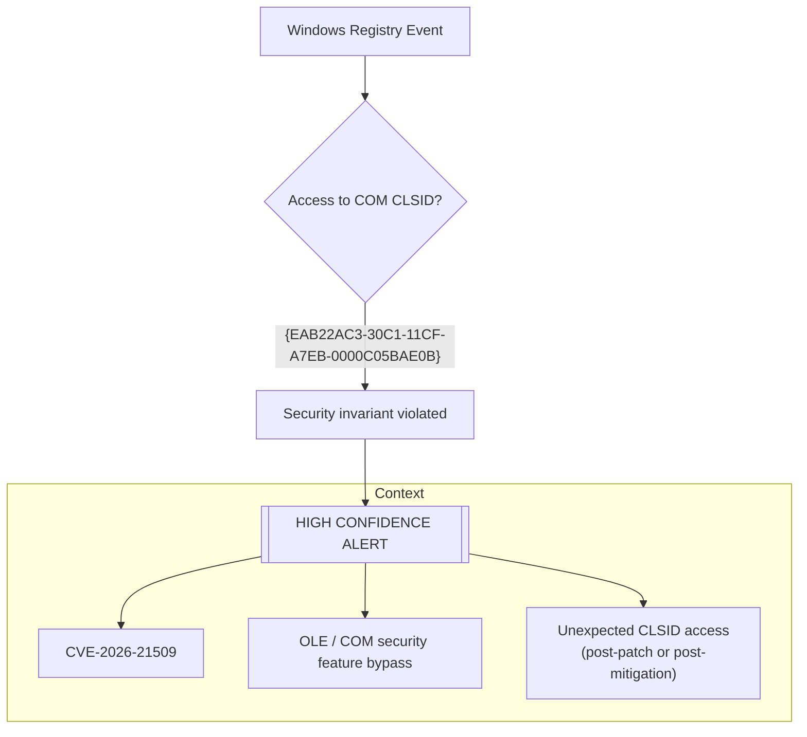

# CVE-2026-21509 — Microsoft Office Security Feature Bypass

## Overview

This repository provides a **single, high-confidence Sigma detection rule** for **CVE-2026-21509**, a Microsoft Office vulnerability that allows attackers to **bypass built-in OLE/COM security protections** using untrusted inputs.

Unlike traditional Office exploit detections that rely on multiple noisy indicators, this project intentionally focuses on **one strict and deterministic signal** explicitly documented by Microsoft.

---

## Detection Logic (Final Diagram)



> Note: This Mermaid diagram avoids HTML tags to ensure GitHub rendering compatibility.

This diagram illustrates that **any access to the vulnerable CLSID represents a violation of a Microsoft security invariant** on patched or mitigated systems.

---

## Why only ONE detection rule?

Microsoft explicitly identifies the **core technical indicator** of this vulnerability:

- A **specific COM CLSID** `{EAB22AC3-30C1-11CF-A7EB-0000C05BAE0B}`
- Referenced in Microsoft advisories
- Used in public proof-of-concept exploits
- Explicitly blocked via the official COM Compatibility kill-bit

On a protected system, **this CLSID must never be accessed**.

As a result, monitoring this single signal provides a **low-noise, high-confidence detection** of exploitation attempts.

---

## Included Content

```text
CVE-2026-21509_Microsoft_Office_Security_Feature_Bypass/
├── decision-table/
│   ├── Decision_Table_CVE-2026-21509_EN.md
│   └── Decision_Table_CVE-2026-21509_FR.md
├── diagrams/
│   ├── README.md
│   └── README_FR.md
├── playbook/
│   └── Playbook_CVE-2026-21509_Generic.yml
├── README_FR.md
├── README.md
└── rules/
    └── office_com_clsid_security_feature_bypass_cve_2026_21509.yml
```

---

## References

- Microsoft Security Advisory: https://msrc.microsoft.com/update-guide/vulnerability/CVE-2026-21509
- CVE Record: https://www.cve.org/CVERecord?id=CVE-2026-21509
- Public PoC: https://github.com/Ashwesker/Ashwesker-CVE-2026-21509

---
**Author:** Adama ASSIONGBON – SOC & CTI Consultant  
[LinkedIn Profile](https://www.linkedin.com/in/adama-assiongbon-9029893a/)
