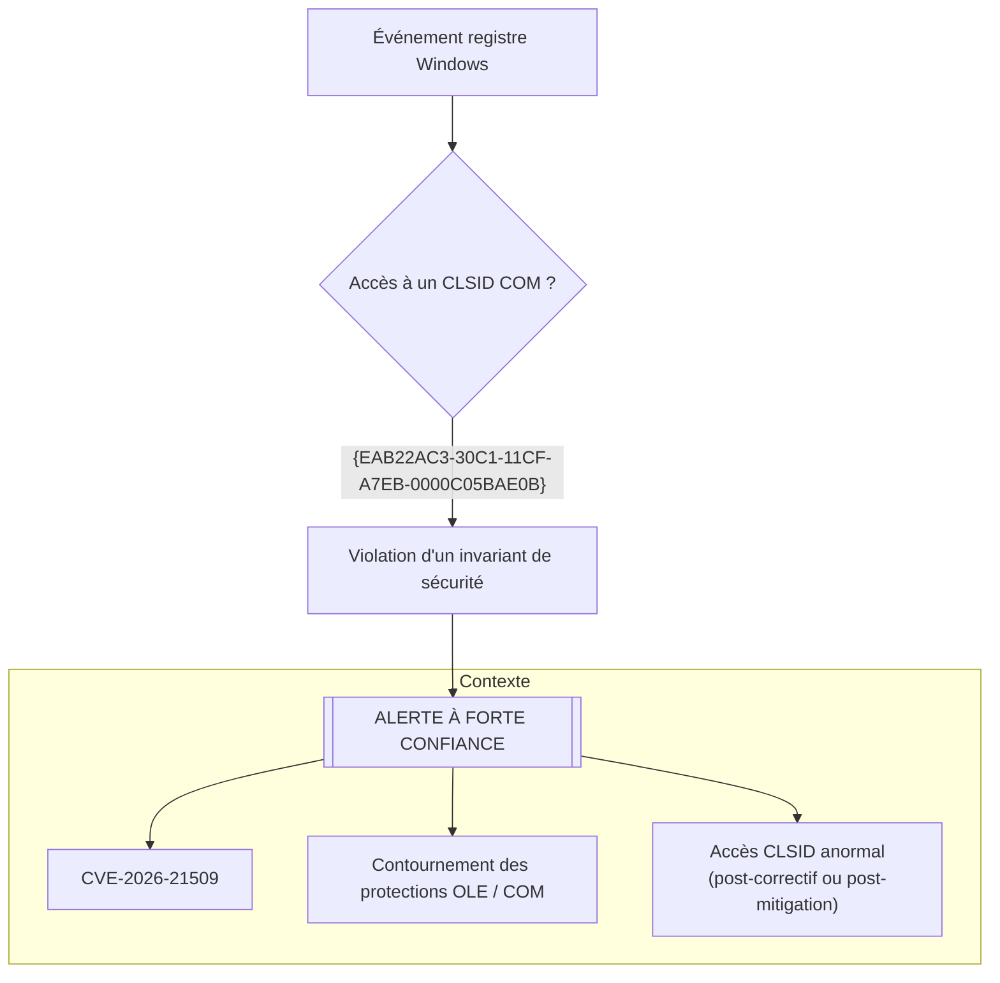

# CVE-2026-21509 — Contournement des mécanismes de sécurité Microsoft Office

## Présentation

Ce dépôt fournit **une règle Sigma unique, stricte et à forte confiance** pour la vulnérabilité **CVE-2026-21509**, affectant Microsoft Office.
Cette vulnérabilité permet à un attaquant de **contourner les protections OLE/COM** via un document Office piégé nécessitant une interaction utilisateur.

---

## Logique de détection (Diagramme final)

> Note : ce diagramme Mermaid évite les balises HTML pour garantir un rendu GitHub stable.

Ce diagramme montre que **tout accès à ce CLSID constitue une anomalie critique** sur un système corrigé ou correctement mitigé.

---

## Pourquoi une seule règle de détection ?

Microsoft identifie clairement **l’indicateur technique central** de cette vulnérabilité :

- Un **CLSID COM spécifique** `{EAB22AC3-30C1-11CF-A7EB-0000C05BAE0B}`
- Mentionné dans l’avis MSRC
- Utilisé dans les PoC publics
- Bloqué officiellement via un kill-bit COM Compatibility

Sur un système protégé, **ce CLSID ne doit jamais être sollicité**.

Il s’agit donc d’un cas rare où **une seule règle de détection est suffisante, robuste et défendable**.

---

## Références

- Avis de sécurité Microsoft : https://msrc.microsoft.com/update-guide/vulnerability/CVE-2026-21509
- Fiche CVE : https://www.cve.org/CVERecord?id=CVE-2026-21509
- Preuve de concept publique : https://github.com/Ashwesker/Ashwesker-CVE-2026-21509

---
**Auteur :** Adama ASSIONGBON – Consultant SOC & CTI  
[Profil LinkedIn](https://www.linkedin.com/in/adama-assiongbon-9029893a/)
