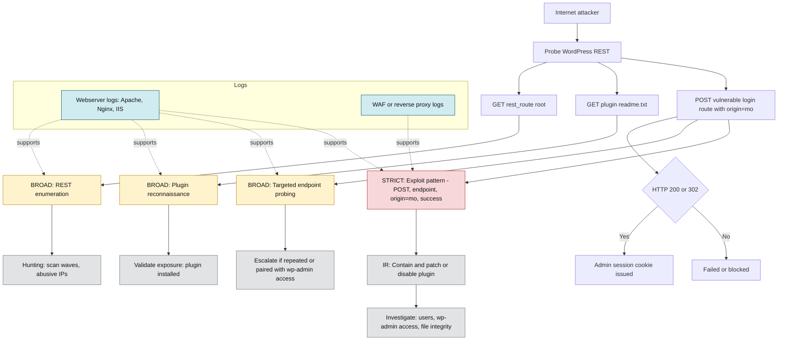

# CVE-2026-23550 — WordPress Modular DS Detection Pack
👉🏾 [ **French version available here**](README_FR.md)

Critical vulnerability allowing unauthenticated administrator session issuance via a vulnerable REST endpoint.

---

## 🔎 Detection Overview

### 🟠 BROAD Rule
**Detects:**
- REST endpoint abuse attempts
- `origin=mo` parameter usage
- Enumeration of plugin `readme.txt`
- General `rest_route=` probing

**Use case:**
- Threat hunting
- Early warning detection

---

### 🔴 STRICT Rule
**Detects:**
- HTTP POST request
- `rest_route=/api/modular-connector/login`
- `origin=mo` parameter
- Successful HTTP response (200/302)

**Use case:**
- High-confidence SOC alerting
- Production environments

---

## 🧠 MITRE ATT&CK Mapping
- T1190 - Exploit Public-Facing Application
- T1078 - Valid Accounts
- T1136 - Create Account (post-exploitation scenario)

---

## 📊 Attack & Detection Flow

---

## 📁 Structure
- rules/
- diagrams/
- decision-table/
- playbooks/

---

## ⚠️ Response Priority
STRICT detections should be treated as potential security incidents.
