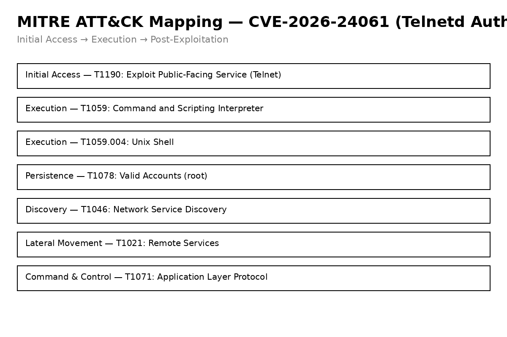

👉🏾  **French version here** : [README_FR.md](README_FR.md)
# CVE-2026-24061 : Telnetd Authentication Bypass
## Sigma Detection Rules (BROAD / STRICT)

---

## 🎯 Purpose

This repository provides **Sigma detection rules for Linux environments** to detect the exploitation of **CVE-2026-24061**, an **authentication bypass vulnerability** in `telnetd` allowing **unauthenticated remote root access**.

The rules follow **Detection Engineering best practices** and are designed for **SOC, CTI, and Threat Hunting teams**.

---

## 📂 Repository Structure

```text
CVE-2026-24061_Bypass_Telnetd/
└── rules
    ├── process_creation_linux_telnet_cve_2026_24061_broad.yml
    └── remote_authentication_bypass_telnetd_cve_2026_24061.yml
```

---

## 🧩 Detection Rules Overview

### 🟡 BROAD Rule : Post-Exploitation & Variants Detection

**File:**  
`process_creation_linux_telnet_cve_2026_24061_broad.yml`

**Severity:**  
🟠 **HIGH**

**Role:**  
This rule provides **broad visibility and hunting capabilities** by detecting
**suspicious command execution spawned by `telnetd`**.

**What it detects:**
- `telnetd` spawning commands with offensive patterns such as:
  - remote downloads (`http://`, `https://`)
  - inline execution (`python -c`, `sh -c`)
  - reverse shells (`nc -e`, `/dev/tcp`)

**Important note:**  
This rule is **not intended to detect the public PoC directly**.  
Its purpose is to detect **post-exploitation activity** or **future exploit variants**
that do not rely on the `-f root` flag.

---

### 🔴 STRICT Rule : Direct Exploit Detection

**File:**  
`remote_authentication_bypass_telnetd_cve_2026_24061.yml`

**Severity:**  
🔴 **CRITICAL**

**Role:**  
This rule detects the **direct exploitation of CVE-2026-24061** as demonstrated
in the public PoC.

**What it detects:**
- `telnetd` spawning the `login` binary
- Suspicious use of the `-f root` flag
- Strong indicator of **authentication bypass leading to root access**

---

## ⚔️ Attack Scenario (Simplified)

1. Attacker scans for exposed Telnet services.
2. Vulnerable `telnetd` is identified.
3. CVE-2026-24061 is exploited via argument injection.
4. `login -f root` is executed without authentication.
5. Root access is obtained.
6. Post-exploitation activity follows.

Detection mapping:
- Step 4 → **STRICT**
- Step 6 → **BROAD**
## 🗺️ MITRE ATT&CK Mapping


