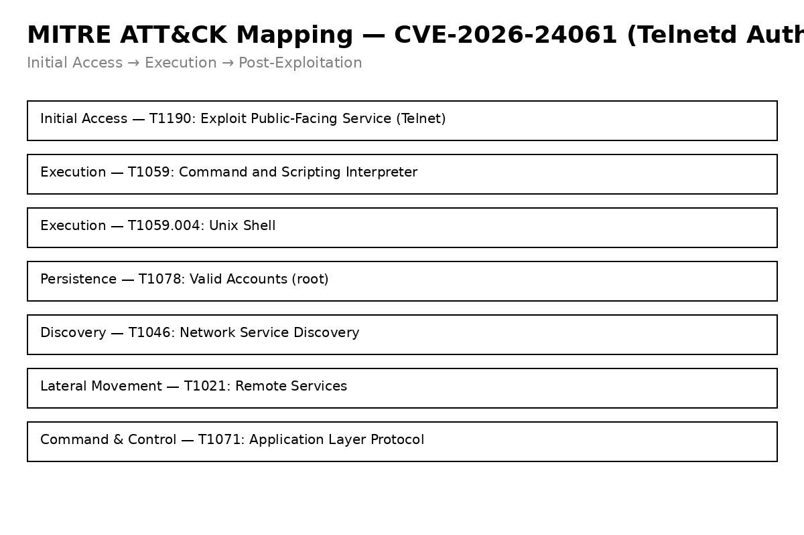

# CVE-2026-24061 : Telnetd Authentication Bypass
👉🏾 [French version available here](README_FR.md)


Sigma detection rules (BROAD / STRICT)

---

## 🎯 Purpose

This repository provides **Sigma detection rules for Linux environments** to detect the exploitation of **CVE-2026-24061**, an **authentication bypass vulnerability** in `telnetd` allowing **unauthenticated remote root access**.

The rules follow **Detection Engineering best practices** and are designed for **SOC, CTI, and Threat Hunting teams**.

---

## 📂 Repository structure

```text
CVE-2026-24061_Bypass_Telnetd/
└── rules
    ├── process_creation_linux_telnet_cve_2026_24061_broad.yml
    └── remote_authentication_bypass_telnetd_cve_2026_24061.yml
```

---

## 🧩 Detection rules overview

### 🟡 BROAD rule : post-exploitation & variants detection

**File:**  
[process_creation_linux_telnet_cve_2026_24061_broad.yml](./rules/process_creation_linux_telnet_cve_2026_24061_broad.yml)

**Severity:**  
🟠 **MEDIUM**

**Role:**  
This rule provides **broad visibility and hunting capabilities** by detecting
**suspicious command execution spawned by `telnetd`** after exploitation or during variant activity.

**What it detects:**
- `telnetd` spawning commands with offensive patterns such as:
  - remote downloads (`http://`, `https://`)
  - inline execution (`python -c`, `sh -c`)
  - reverse shells (`nc -e`, `/dev/tcp`)

**Important note:**  
This rule is **not intended to detect the public PoC directly**.  
Its purpose is to detect **post-exploitation activity** or **future exploit variants**
that do not rely on the `-f root` flag.

---

### 🔴 STRICT rule : direct exploit detection

**File:**  
[remote_authentication_bypass_telnetd_cve_2026_24061.yml](./rules/remote_authentication_bypass_telnetd_cve_2026_24061.yml)

**Severity:**  
🔴 **CRITICAL**

**Role:**  
This rule detects the **direct exploitation of CVE-2026-24061** as demonstrated
in the public PoC.

**What it detects:**
- `telnetd` spawning the `login` binary
- Suspicious use of the `-f root` flag
- Strong indicator of **authentication bypass leading to root access**

---

## ⚔️ Attack scenario (simplified)

1. Attacker scans for exposed Telnet services.
2. Vulnerable `telnetd` is identified.
3. CVE-2026-24061 is exploited via argument injection.
4. `login -f root` is executed without authentication.
5. Root access is obtained.
6. Post-exploitation activity follows.

Detection mapping:
- Step 4 → **STRICT**
- Step 6 → **BROAD**
## 🗺️ MITRE ATT&CK Mapping

---
**Author :** Adama ASSIONGBON – SOC & CTI Consultant  
**Contact:** [LinkedIn Profile](https://www.linkedin.com/in/adama-assiongbon-9029893a/)

## Rule relationships
When a pack contains more than one detection, use `related` metadata to link companion rules.
Treat the broader alert as the hunt signal and the stricter alert as the confirmation signal when both exist.
Correlate on the same host, user, or short time window.

