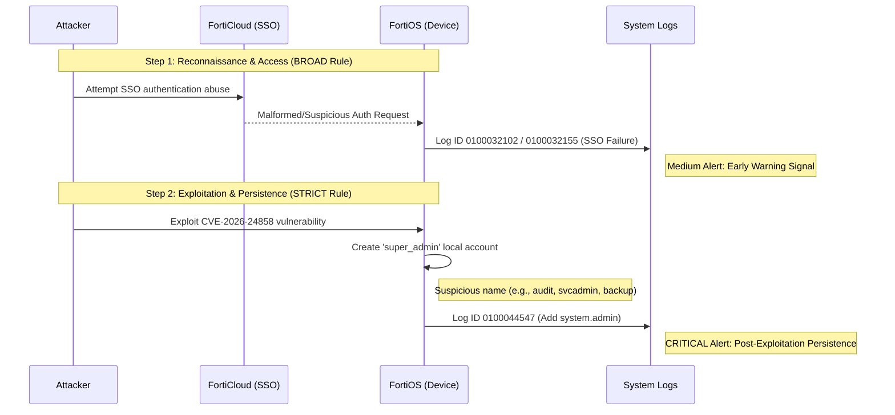

# Attack → Detection → Response Diagram (CVE-2026-24858)
👉🏾 [ French version available here](./README_FR.md)
## 🎯 Purpose

This diagram illustrates the **full attack lifecycle** of CVE-2026-24858 and how it maps to **SOC detection and response** using this detection pack.

It helps analysts and stakeholders quickly understand:
- How the attack unfolds
- Where detection occurs (BROAD vs STRICT)
- How Incident Response is triggered and executed

---
## 📊 Attack Flow Diagram (Mermaid)

---
## 🧭 Diagram overview

### Attack phase
- Abuse of FortiCloud SSO
- Administrative login
- Configuration download
- Creation of a local super_admin account (persistence)

### Detection phase
- **BROAD** rule detects SSO anomalies
- **STRICT** rule confirms exploitation via admin creation

### Response phase
- Containment
- Eradication
- Recovery
- Post-incident improvements

---

## 🛡️ Usage

- SOC training
- Incident Response preparation
- Management or audit explanation
- GitHub documentation rendering

---

**Auteur :** Adama ASSIONGBON – SOC & CTI Consultant  
[LinkedIn Profile](https://www.linkedin.com/in/adama-assiongbon-9029893a/)

