👉🏾 English version available here: [README.md](./README.md)

# Diagramme Attack → Detection → Response (CVE-2026-24858)

## 🎯 Objectif

Ce diagramme illustre le **cycle complet de l’attaque** liée à la CVE-2026-24858 et sa correspondance avec la **détection et la réponse SOC**.

Il permet de comprendre rapidement :
- Le déroulement de l’attaque
- Les points de détection (BROAD vs STRICT)
- Le déclenchement et l’exécution de la réponse à incident

---
## 📊 Diagramme de flux d'attaque (Mermaid)

```mermaid
sequenceDiagram
    participant A as Attaquant
    participant F as FortiCloud (SSO)
    participant O as FortiOS (Dispositif)
    participant L as Logs Système

    Note over A, O: Étape 1: Reconnaissance & Accès (BROAD)
    A->>F: Tentative d'abus d'authentification SSO
    F-->>O: Requête d'authentification malformée
    O->>L: Log ID 0100032102 / 0100032155 (SSO Failure)
    Note right of L: Alerte Medium: Détection précoce

    Note over A, O: Étape 2: Exploitation & Persistance (STRICT)
    A->>O: Exploitation de la vulnérabilité CVE-2026-24858
    O->>O: Création de compte 'super_admin'
    Note right of O: Nom suspect (ex: backup, svcadmin, audit)
    O->>L: Log ID 0100044547 (Add system.admin)
    Note right of L: Alerte CRITIQUE: Persistance confirmée
```

---
## 🧭 Vue d’ensemble du diagramme

### Phase d’attaque
- Abus de FortiCloud SSO
- Connexion administrateur
- Téléchargement de configuration
- Création d’un compte super_admin (persistance)

### Phase de détection
- Règle **BROAD** : anomalies SSO
- Règle **STRICT** : création admin locale

### Phase de réponse
- Confinement
- Éradication
- Restauration
- Post-incident

---

## 🛡️ Usage

- Formation SOC
- Préparation Incident Response
- Communication management / audit
- Documentation GitHub

---
 
 
 ✍🏿 **Auteur :** Adama ASSIONGBON – SOC & CTI Consultant  
[LinkedIn Profile](https://www.linkedin.com/in/adama-assiongbon-9029893a/)

