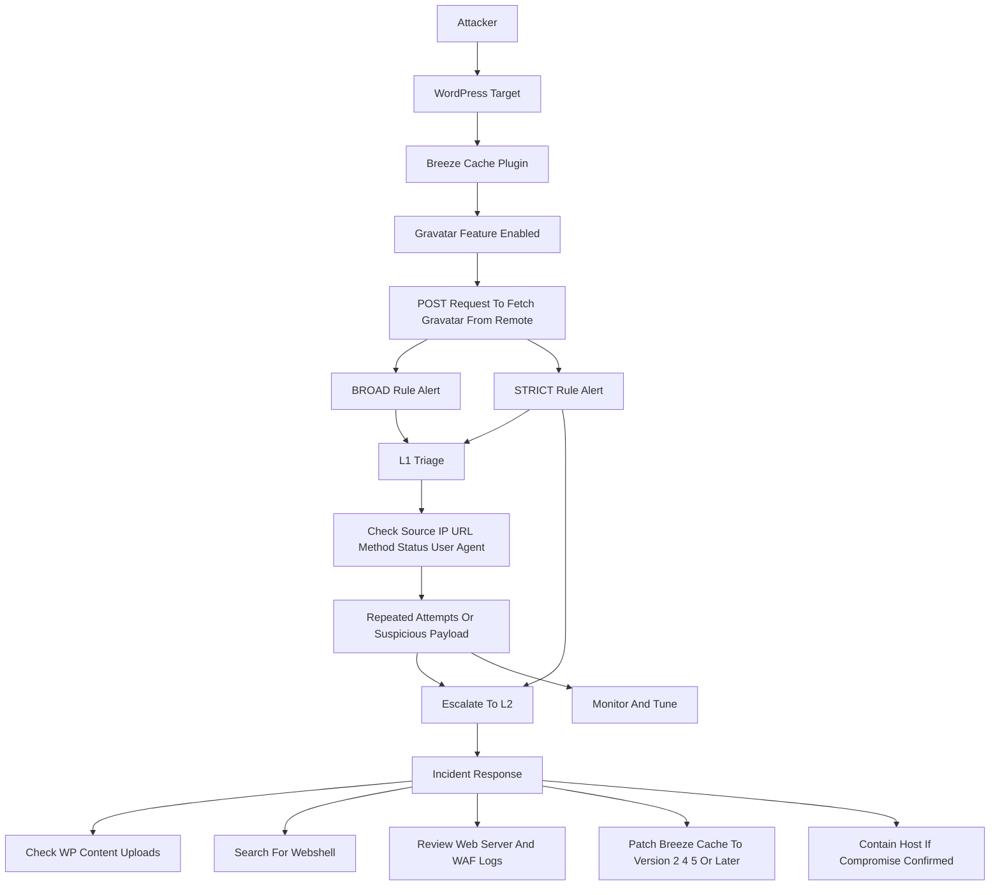

```mermaid
graph TD
A[Attacker] --> B[WordPress Target]
B --> C[Breeze Cache Plugin]
C --> D[Gravatar Feature Enabled]
D --> E[POST Request To Fetch Gravatar From Remote]
E --> F[BROAD Rule Alert]
E --> G[STRICT Rule Alert]
G --> H[Body or URL payload markers]
F --> H[L1 Triage]
H --> I[Check Source IP URL Method Status User Agent]
I --> J[Repeated Attempts Or Suspicious Payload]
J --> K[Escalate To L2]
J --> L[Monitor And Tune]
G --> K
K --> M[Incident Response]
M --> N[Check WP Content Uploads]
M --> O[Search For Webshell]
M --> P[Review Web Server And WAF Logs]
M --> Q[Patch Breeze Cache To Version 2 4 5 Or Later]
M --> R[Contain Host If Compromise Confirmed]
```
