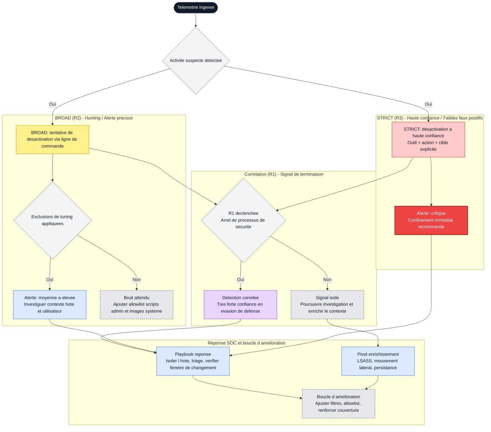

# 📊 BROAD vs STRICT – Neutralisation des outils de sécurité
[👉🏾**English version available here**](README.md)

```mermaid
flowchart TD
  %% Evasion de defense - Neutralisation des outils de securite (BROAD vs STRICT) - Compatible GitHub

  A([Telemetrie ingeree]):::start --> B{Activite suspecte detectee}:::decision

  subgraph BROAD["BROAD (R2) - Hunting / Alerte precoce"]
    direction TB
    C[BROAD: tentative de desactivation via ligne de commande]:::broad
    D{Exclusions de tuning appliquees}:::decision
    E[Alerte: moyenne a elevee\nInvestiguer contexte hote et utilisateur]:::action
    F[Bruit attendu\nAjouter allowlist scripts admin et images systeme]:::note
    C --> D
    D -->|Oui| E
    D -->|Non| F
  end

  subgraph STRICT["STRICT (R3) - Haute confiance / Faibles faux positifs"]
    direction TB
    G[STRICT: desactivation a haute confiance\nOutil + action + cible explicite]:::strict
    H[Alerte: critique\nConfinement immediat recommande]:::critical
    G --> H
  end

  subgraph CORR["Correlation (R1) - Signal de terminaison"]
    direction TB
    I{R1 declenchee\nArret de processus de securite}:::decision
    J[Detection correlee\nTres forte confiance en evasion de defense]:::corr
    K[Signal isole\nPoursuivre investigation et enrichir le contexte]:::note
    I -->|Oui| J
    I -->|Non| K
  end

  subgraph RESP["Reponse SOC et boucle d amelioration"]
    direction TB
    L[Playbook reponse\nIsoler l hote, triage, verifier fenetre de changement]:::action
    M[Pivot enrichissement\nLSASS, mouvement lateral, persistance]:::action
    N[Boucle d amelioration\nAjuster filtres, allowlist, renforcer couverture]:::note
    L --> N
    M --> N
  end

  B -->|Oui| C
  B -->|Oui| G

  C --> I
  G --> I

  J --> L
  E --> L
  H --> L
  K --> M

  classDef start fill:#111827,stroke:#6b7280,color:#ffffff,stroke-width:1px;
  classDef decision fill:#f3f4f6,stroke:#6b7280,color:#111827,stroke-width:1px;
  classDef broad fill:#fef08a,stroke:#ca8a04,color:#111827,stroke-width:1px;
  classDef strict fill:#fecaca,stroke:#b91c1c,color:#111827,stroke-width:1px;
  classDef critical fill:#ef4444,stroke:#7f1d1d,color:#ffffff,stroke-width:2px;
  classDef corr fill:#e9d5ff,stroke:#7c3aed,color:#111827,stroke-width:1px;
  classDef action fill:#dbeafe,stroke:#2563eb,color:#111827,stroke-width:1px;
  classDef note fill:#e5e7eb,stroke:#374151,color:#111827,stroke-dasharray: 4 3;
```
