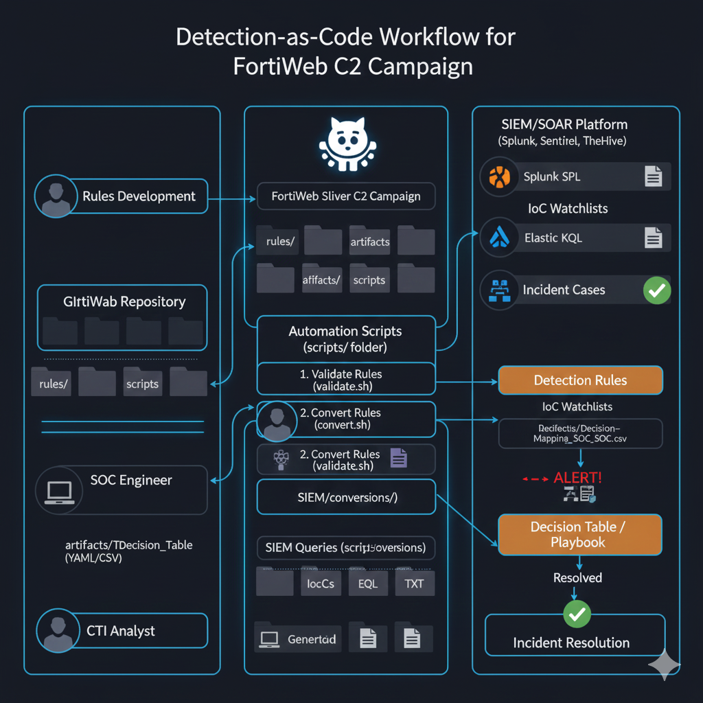

# Table de Décision – Détection Linux Sliver / FRP / LPD Masquerade 
[👉🏾 English version available here: ](./README.md)
## Objectif
Cette table de décision aide les analystes SOC à qualifier et traiter les alertes générées par les règles Linux liées aux implants Sliver, à l’utilisation de FRP et au masquage LPD.

---

## Table de Décision de Détection

| Étape | Alerte / Règle Déclenchée | Question Clé | Si OUI | Si NON |
|-----:|---------------------------|--------------|--------|--------|
| 1 | Exécution FRP détectée | `frpc` est-il exécuté depuis un chemin non standard ou par un processus parent inhabituel ? | Passer à l’étape 2 | Marquer comme *Suspect – Contexte requis* |
| 2 | Exécution cups-lpd / microsocks | Le processus `cups-lpd` utilise-t-il des arguments SOCKS (`-p 515`, `-w`, `-1`) ? | Passer à l’étape 3 | Investiguer comme mauvaise configuration |
| 3 | Listener TCP 515 détecté | Un processus non CUPS écoute-t-il sur le port TCP 515 ? | Passer à l’étape 4 | Confiance réduite – surveiller |
| 4 | Déploiement implant Sliver | Un binaire `system-updater` ou caché est-il créé dans des répertoires suspects ? | Passer à l’étape 5 | Continuer la surveillance |
| 5 | Persistance systemd | Un service systemd suspect de type `Updater Service` est-il créé ? | **COMPROMISSION CONFIRMÉE** | Investigation approfondie |

---

## Aide à la Qualification SOC

| Condition | Verdict |
|---------|---------|
| Étapes 1–3 uniquement | Activité suspecte / Phase précoce |
| Étapes 1–4 | Forte probabilité de post-exploitation |
| Étapes 1–5 | **Compromission Sliver confirmée** |

---

## Actions Recommandées
- Isoler immédiatement l’hôte
- Collecter les artefacts mémoire et disque
- Désactiver les services systemd malveillants
- Rechercher des mouvements latéraux
- Lancer la procédure de réponse à incident

## ✍🏿 Auteur
[Adama ASSIONGBON – Consultant SOC & CTI](https://www.linkedin.com/in/adama-assiongbon-9029893a/)

