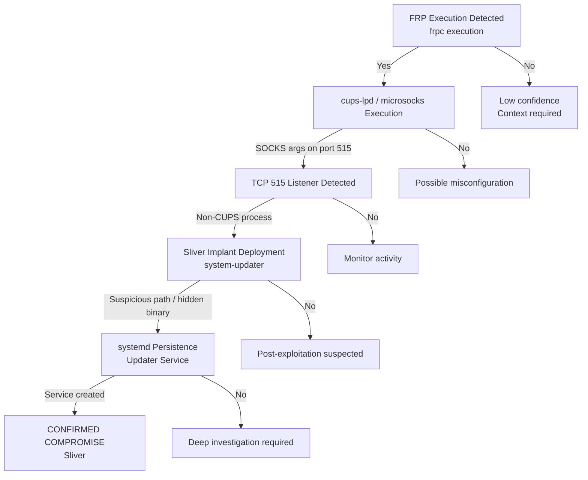

# Detection Decision Flow – Linux Sliver / FRP / LPD 
[👉🏾 French version available here: ](./README_FR.md)

```mermaid
flowchart TD
    A[FRP Execution Detected<br/>frpc execution] -->|Yes| B[cups-lpd / microsocks Execution]
    A -->|No| A1[Low confidence<br/>Context required]

    B -->|SOCKS args on port 515| C[TCP 515 Listener Detected]
    B -->|No| B1[Possible misconfiguration]

    C -->|Non-CUPS process| D[Sliver Implant Deployment<br/>system-updater]
    C -->|No| C1[Monitor activity]

    D -->|Suspicious path / hidden binary| E[systemd Persistence<br/>Updater Service]
    D -->|No| D1[Post-exploitation suspected]

    E -->|Service created| F[CONFIRMED COMPROMISE<br/>Sliver]
    E -->|No| E1[Deep investigation required]
```
