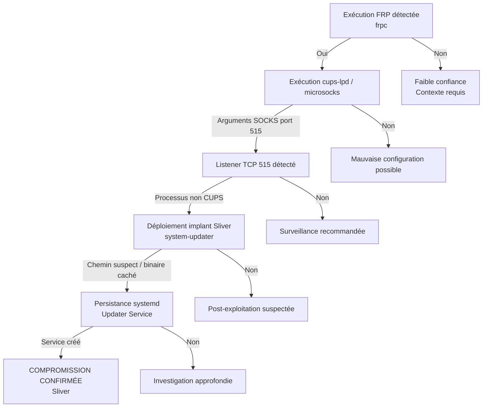

# Flux de Décision – Détection Linux Sliver / FRP / LPD 
[👉🏾 English version available here: ](./README.md)

```mermaid
flowchart TD
    A[Exécution FRP détectée<br/>frpc] -->|Oui| B[Exécution cups-lpd / microsocks]
    A -->|Non| A1[Faible confiance<br/>Contexte requis]

    B -->|Arguments SOCKS port 515| C[Listener TCP 515 détecté]
    B -->|Non| B1[Mauvaise configuration possible]

    C -->|Processus non CUPS| D[Déploiement implant Sliver<br/>system-updater]
    C -->|Non| C1[Surveillance recommandée]

    D -->|Chemin suspect / binaire caché| E[Persistance systemd<br/>Updater Service]
    D -->|Non| D1[Post-exploitation suspectée]

    E -->|Service créé| F[COMPROMISSION CONFIRMÉE<br/>Sliver]
    E -->|Non| E1[Investigation approfondie]
```
