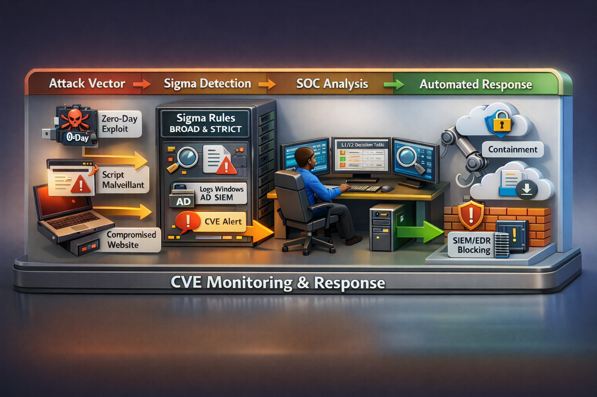

<!-- Badges (edit the links if you rename the repo/branch) -->


# 🛡️ Sigma Detection Framework for SOC Operations



## 🎯 Purpose

This repository provides a **structured, SOC-oriented detection framework** based on **Sigma rules**, enriched with:
- Detection logic (BROAD & STRICT),
- SOC decision tables (L1/L2),
- SOAR playbooks (TheHive, Shuffle),
- Attack diagrams and workflows,
- Real-world CVE-driven detection strategies.

It is designed for **Security Operations Centers (SOC)**, **Blue Teams**, and **Detection Engineers** seeking actionable, production-ready detections.

---

## 🧠 Detection Strategy Overview (SOC Doctrine)

All detections follow a **two-layer detection model**:

### 🔍 BROAD Rules — Visibility & Hunting
- Wide behavioral coverage
- Early-stage detection of suspicious activity
- Designed for:
  - Threat hunting
  - Weak-signal detection
  - Baseline deviation monitoring

### 🎯 STRICT Rules — Confirmation & Alerting
- High-confidence detection
- Focus on:
  - Malicious command-line patterns
  - LOLBins abuse
  - Exploit-like execution chains
- Designed for:
  - SOC alerting
  - Incident response
  - Automated SOAR workflows

➡️ **SOC Best Practice**  
BROAD rules should trigger **contextual investigation**.  
STRICT rules confirm malicious intent and justify **incident escalation**.

---

## 🔗 Correlation Logic

Effective detection relies on **correlation**, not single alerts:

- BROAD ➜ behavioral signal
- STRICT ➜ malicious confirmation
- Decision Table ➜ SOC action (L1/L2)
- Playbook ➜ response automation

This layered model significantly reduces **false positives** while preserving **early visibility**.

---

## 🧩 Repository Structure

Each CVE or detection topic follows a consistent structure:

```
CVE-XXXX-YYYY/
├── rules/              # Sigma BROAD & STRICT rules
├── diagrams/           # Attack flows & SOC views
├── decision-table/     # L1/L2 SOC decision logic
├── playbook/           # SOAR & TheHive playbooks
├── README.md           # Technical & SOC guidance
```

---

## ⚙️ Sigma Compatibility & Validation

All rules are:
- Validated using `sigma check`
- Convertible across multiple SIEMs:
  - OpenSearch / ELK
  - Splunk
  - Elastic (Lucene, EQL, ElastAlert)
  - NetWitness
  - SentinelOne (where applicable)

A validation script is provided:
```bash
scripts/validate_all_rules.sh
```

---

## 🧠 Target Audience

- SOC Analysts (L1 / L2 / L3)
- Blue Team Engineers
- Detection Engineers
- Threat Hunters
- Security Consultants

---

## ✍️ Author

**Adama Assiongbon**  
SOC / CTI Analyst Consultant  
LinkedIn: https://www.linkedin.com/in/adama-assiongbon/

---

## 📜 License & Usage

This repository is intended for **defensive security operations** only.
Use responsibly within legal and ethical boundaries.
