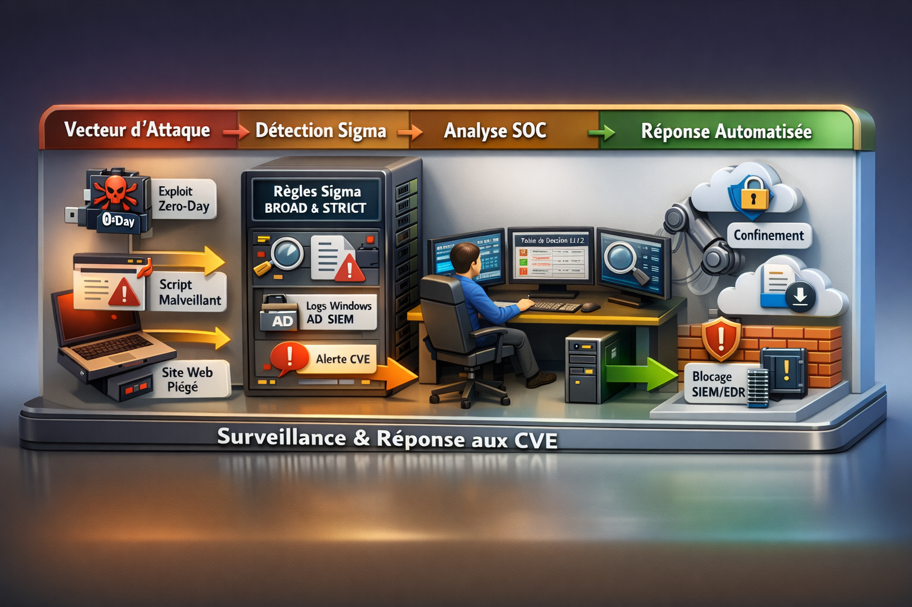

# 🛡️ sigma-rules - SOC Detection Packs (Sigma + Response)

### Sigma Rules for CVE Detection & SOC / Blue Team Operations

<!-- Badges (edit the links if you rename the repo/branch) -->


A curated repository of **SOC-ready detection packs** for high-impact vulnerabilities (Patch Tuesday, vendor advisories),
built around **Sigma rules**, **attack-flow diagrams**, **SOC analyst L1/L2 decision tables**, and **SOAR playbooks**.

🇫🇷 Version française: [README_FR.md](README_FR.md)

---

## 🎯 What you get (per pack)
- ✅ Sigma rules (**BROAD** + **STRICT** when applicable)
- 🧭 Attack-flow diagrams (SVG + PNG)
- 📋 SOC analyst L1/L2 decision tables (Markdown + PDF when relevant)
- 🐝 SOAR-ready playbooks (TheHive YAML templates)
- 📘 Pack READMEs (EN default + FR)

---

## 📦 Available Packs

| Pack | Focus | Artifacts |
|---|---|---|
| **CVE-2025-54100 – Windows Userland RCE** | PowerShell/IWR + child execution patterns | Rules + Diagrams + Decision Table + TheHive Playbook |
| **CVE-2025-62221 – Windows Kernel EoP** | User→SYSTEM anomaly + post‑EoP execution | Rules + Diagrams + Decision Table + TheHive Playbook |
| **CVE-2025-50165 – Windows Graphics** | Document/renderer exploitation patterns | Rules + Diagrams + Playbook |
| **CVE-2025-6218 – WinRAR** | Archive exploitation + post‑execution | Rules + Diagrams + Playbook |

> Repository structure is pack-first (one folder per CVE pack).

---

## 🗂️ Repository Structure

```text
sigma-rules/
├── CVE-2025-54100_WindowsUserland/
├── CVE-2025-62221_WindowsKernel/
├── CVE-2025-50165_WindowsGraphics/
├── CVE-2025-6218_WinRAR/
├── diagrams/                  # Global diagrams (overview, reusable visuals)
├── INSTALLATION.md            # Sigma tooling / install guidance
├── CHANGELOG.md               # Release history
├── README.md                  # EN (default)
└── README_FR.md               # FR
```

---

## 🚀 Quickstart

### 1) Validate a rule
```bash
sigma check <rule.yml>
```

### 2) Convert to a backend (example: ElastAlert)
```bash
sigma convert -t elastalert -p windows-logsources <rule.yml>
```

> For OpenSearch Lucene, you may need a processing pipeline:
> `sigma list pipelines opensearch_lucene`

---

## 🧩 Conventions

### Naming
- Packs: `CVE-YYYY-NNNNN_Context/`
- Rules: behavior-based names (not only CVE), with `_broad` / `_strict` where relevant.
- Docs: `README.md` (EN default) + `README_FR.md`

### Severity
- BROAD: Medium (triage/hunting)
- STRICT: High (actioning/containment)

---
## 🧠 Diagramme  SOC



## 📌 Release v0.2.0
- Added full pack for **CVE-2025-54100** (rules + diagrams + decision table + TheHive playbook).
See: [CHANGELOG.md](CHANGELOG.md)


