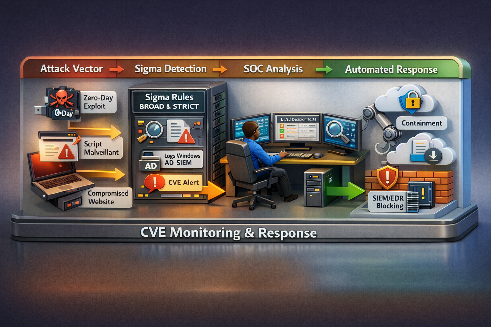

<!-- Badges -->


# 🛡️ Sigma detection framework for SOC operations
👉🏾 [French version available here](README_FR.md)




## Sigma rules -SOC detection engineering framework

This repository provides a **production-oriented SOC detection engineering framework** based on **Sigma rules**, **CTI-driven analysis**, and **real-world attack campaigns**.

This framework is designed to help SOC teams:
- Detect exploitation attempts **early**
- Reduce false positives
- Maintain detection coverage even as attacker tooling evolves

---

## Detection philosophy

This project avoids static IoCs (hashes, filenames, IPs) and instead relies on behavior-based detection using attack patterns and invariants, validated in real SOC environments.
Detection logic follows a **layered, SOC-tested, and resilient approach**:

- **BROAD rules** for visibility and threat hunting
- **STRICT rules** for confirmation and high-confidence alerting
- **Behavioral detections** resilient to payload renaming
- **Network invariants** for edge devices and appliances without EDR
- **Correlation logic** to confirm and contextualize incidents

Each CVE detection pack is documented in its own directory and includes Sigma rules, decision tables, and SOC playbooks.

> Detection engineering should not break when attackers rename files.

---

## Campaign-based detection packs

Beyond CVE-centric detections, this repository includes **campaign-oriented detection packs** based on real-world threat actor activity.

These packs are built from **incident analysis and CTI research**, not theoretical attack models.

They provide:
- Full attack lifecycle coverage
- Detection of renamed or evolving payloads (v2 / v3)
- Network and behavioral invariants
- SOC-ready decision tables and response playbooks

### Examples
- FortiWeb exploitation with Sliver C2 and proxy masquerading (campaign-based pack)
- CVE-focused detection packs designed for SOC anticipation and post-disclosure exploitation monitoring:
  - Windows Kernel / Graphics / Userland vulnerabilities (Patch Tuesday)
  - Microsoft Office vulnerabilities
  - WinRAR vulnerabilities
  - Azure Monitor Agent vulnerabilities
  - Microsoft Copilot vulnerabilities

CVE packs help SOC teams anticipate **weaponization phases** using BROAD and STRICT rules combined with SOC-ready artifacts (decision tables, playbooks, diagrams).

---

## SOC & SOAR integration

Rules are designed for **production SOC environments** and can be integrated with:
- SIEM platforms (Elastic, OpenSearch, Splunk, Sentinel, QRadar)
- SOAR platforms such as **TheHive**, Cortex, and Shuffle

---

## Repository structure

Each detection pack follows a **consistent and reusable structure**:
- Sigma rules
- Decision tables
- Playbooks
- Diagrams

---

## Getting started

### 1. Install sigma-cli and the plugins

```bash
pip install pipx && pipx ensurepath   # restart terminal after this
pipx install sigma-cli
sigma plugin install opensearch elasticsearch splunk sysmon windows kusto netwitness
```

Full step-by-step guide: [INSTALLATION.md](INSTALLATION.md)

### 2. Validate all rules

```bash
bash scripts/validate_all_rules.sh
```

### 3. Convert to your SIEM

```bash
# All SIEM targets at once (OpenSearch, Splunk, Sentinel, Defender XDR, NetWitness, ...)
bash scripts/convert_all_rules.sh

# Wazuh only
bash scripts/convert_to_wazuh.sh

# QRadar (Lucene fallback with sigma 3.x, native AQL with sigma 2.x)
bash scripts/convert_to_qradar.sh
```

Output: `scripts/conversions/<target>/raw/` — one `.txt` file per rule.

Full scripts documentation: [scripts/README.md](scripts/README.md)

---

## How to use this repository

- Browse CVE or campaign folders
- Start with **BROAD rules** for visibility and hunting
- Escalate to **STRICT rules** for confirmation
- Use decision tables and playbooks for SOC response and triage

---

## Who is this repo for?

SOC analysts • Detection engineers • Blue teams • MSSP
<!--
---
## 📊 Star history

[](https://www.star-history.com/#Hatchepsoute/sigma-rules&type=date&legend=top-left)

> Star history reflects community interest and visibility.  
-->
---
## License

This project is licensed under the **Apache license, version 2.0**.
- Official license text: https://www.apache.org/licenses/LICENSE-2.0
- Repository copy: [LICENSE](LICENSE)

You are free to use, modify, and distribute these Sigma rules, including for commercial purposes, provided that proper attribution is given.

---

⭐ If you use these rules in production or labs, please star the repo  
🔁 Feedback & contributions are welcome

---

**Author:** Adama ASSIONGBON -SOC & CTI Consultant  
[LinkedIn Profile](https://www.linkedin.com/in/adama-assiongbon-9029893a/)

