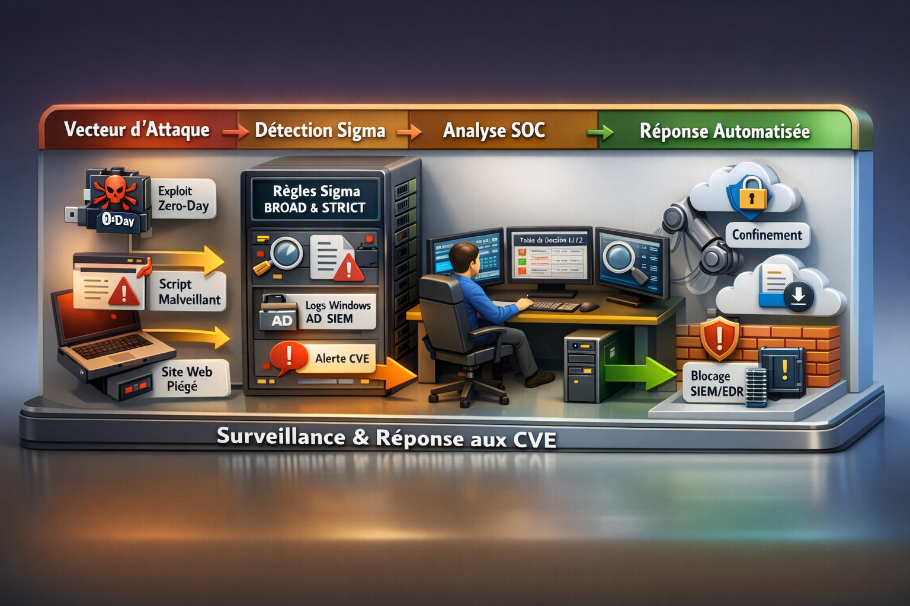

<!-- Badges -->

# 🛡️ Framework de Détection Sigma pour les Opérations SOC

[👉🏾 **Version anglaise disponible ici**](README.md)

## Sigma rules - framework d’ingénierie de détection SOC

Ce dépôt fournit un **framework d’ingénierie de détection SOC orienté production**,  basé sur des **règles Sigma**, une **approche CTI (Cyber Threat Intelligence)** et des **campagnes d’attaque réelles**.

Ce framework est conçu pour aider les équipes SOC à :
- Détecter les tentatives d’exploitation **le plus tôt possible**
- Réduire les faux positifs
- Maintenir une couverture de détection efficace malgré l’évolution des outils adverses

---

## Philosophie de Détection
Les règles de ce projet sont comportementales par conception : elles ne reposent pas sur des IoC statiques, mais sur des invariants d’attaque et des comportements observables, validés en conditions SOC.:
- **Règles BROAD** pour la visibilité et le threat hunting
- **Règles STRICT** pour la confirmation et l’alerte à haute confiance
- **Détections comportementales** résistantes au renommage des payloads
- **Invariants réseau** pour les équipements périmétriques ou sans EDR
- **Logiques de corrélation** pour confirmer et contextualiser les incidents

Chaque pack de détection CVE est documenté dans son propre répertoire et inclut :
des règles Sigma, des tables de décision et des playbooks SOC.

> L’ingénierie de détection ne doit pas échouer lorsque les attaquants renomment leurs fichiers.

---

## Packs de détection basés sur des campagnes

Au-delà des détections centrées sur les CVE, ce dépôt inclut des **packs de détection orientés campagnes**, basés sur l’activité réelle des acteurs de menace.

Ces packs sont construits à partir de **l’analyse d’incidents réels et de recherches CTI**,  et non de scénarios théoriques.

Ils offrent :
- Une couverture complète du cycle d’attaque
- La détection de payloads renommés ou évolutifs (v2 / v3)
- Des invariants réseau et comportementaux
- Des tables de décision SOC et playbooks de réponse prêts à l’emploi

### Exemples
- Exploitation FortiWeb avec Sliver C2 et camouflage via proxy (pack orienté campagne)
- Packs de détection CVE conçus pour l’anticipation SOC et la surveillance post-divulgation :
  - Vulnérabilités Windows Kernel / Graphics / Userland (Patch Tuesday)
  - Vulnérabilités Microsoft Office
  - Vulnérabilités WinRAR
  - Vulnérabilités Azure Monitor Agent
  - Vulnérabilités Microsoft Copilot

Les packs CVE permettent aux équipes SOC d’anticiper les **phases de weaponization**  en combinant règles BROAD et STRICT avec des artefacts SOC prêts à l’emploi  (tables de décision, playbooks, diagrammes).

---

## Intégration SOC & SOAR

Les règles sont conçues pour des **environnements SOC en production** et peuvent être intégrées avec :
- Des plateformes SIEM (Elastic, OpenSearch, Splunk, Sentinel, QRadar)
- Des plateformes SOAR telles que **TheHive**, Cortex et Shuffle

---

## Structure du Dépôt
Chaque pack de détection suit une **structure cohérente et réutilisable** :
- Règles Sigma
- Tables de décision
- Playbooks
- Diagrammes

---

## Comment utiliser ce dépôt

- Parcourir les dossiers CVE ou campagnes
- Commencer par les **règles BROAD** pour la visibilité et le hunting
- Monter en **STRICT** pour la confirmation
- Utiliser les tables de décision et playbooks pour la réponse SOC et le triage

---

## À qui s’adresse ce dépôt ?
Analystes SOC • Ingénieurs détection • Équipes Blue Team • MSSP

<!--
## 📊 Star History

> L’évolution des étoiles reflète l’intérêt et la visibilité communautaire.
-->
---
## Licence

Ce projet est sous licence **Apache license, version 2.0**.
- Texte officiel : https://www.apache.org/licenses/LICENSE-2.0
- Copie du dépôt : [LICENSE](LICENSE)

Vous êtes libre d’utiliser, modifier et distribuer ces règles Sigma,  y compris à des fins commerciales, sous réserve de mentionner l’auteur.

---

⭐ Si vous utilisez ces règles en production ou en laboratoire, pensez à mettre une étoile au dépôt  
🔁 Les retours et contributions sont les bienvenus

---

**Auteur :** Adama ASSIONGBON – Consultant SOC & CTI  
[Profil LinkedIn](https://www.linkedin.com/in/adama-assiongbon-9029893a/)

