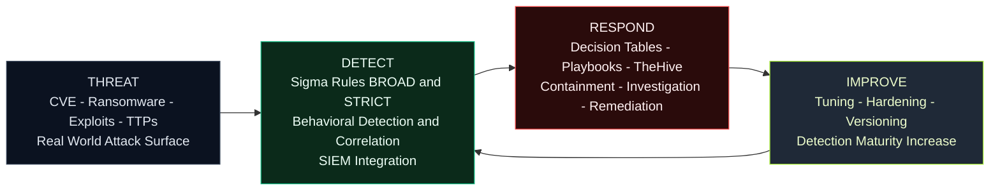

<!-- Badges -->

# Sigma-Rules – Detection Engineering Philosophy

👉🏾 [**French version available here**](README_FR.md)

**Threat → Detect → Respond → Improve**

This diagram represents the operational philosophy behind the **sigma-rules** project.

Unlike a simple collection of Sigma rules, this repository follows a structured Detection Engineering framework designed for real-world SOC environments.

---

## Core Philosophy

The project is built on five principles:

1. **Threat-Driven Engineering**  
   CVEs, real-world campaigns, exploit trends, and CTI analysis are the starting point.

2. **Layered Detection Strategy**  
   - **BROAD** rules for visibility and hunting  
   - **STRIC**T rules for high-confidence production alerts  

3. **Operational Readiness**  
   Decision tables, triage guidance, and response playbooks are included.

4. **Automation Integration**  
   Designed to work with SIEM and SOAR platforms (TheHive, Elastic, OpenSearch, Splunk, Sentinel).

5. **Continuous Improvement**  
   Feedback loop for tuning, false positive reduction, and detection maturity growth.

---

## Executive Framework Diagram

---

## Operational Value

- Reduced MTTD  
- Reduced MTTR  
- Standardized SOC workflows  
- Measurable detection maturity  
- Repeatable detection engineering model  

---

Maintained as part of the **sigma-rules Detection Engineering Project**
---
## ✍🏿 Author
[Adama ASSIONGBON – SOC & CTI Consultant](https://www.linkedin.com/in/adama-assiongbon-9029893a/)

