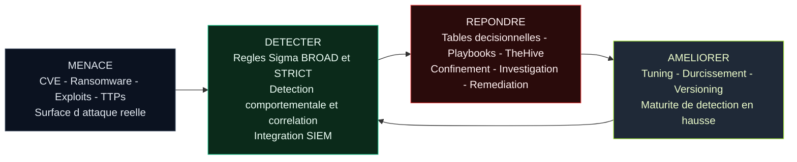

<!-- Badges -->

# Sigma-Rules – Philosophie d’Ingenierie de Detection

👉🏾  [**English version available here**](README.md)

**Menace → Detecter → Repondre → Ameliorer**

Ce diagramme represente la philosophie operationnelle du projet **sigma-rules**.

Ce dépôt n'est pas une simple collection de règles Sigma. Il s agit d un framework structure d'ingénierie de détection conçu pour des environnements SOC reels.

---

## Philosophie Fondamentale

Le projet repose sur cinq principes :

1. **Ingenierie pilotee par la menace**  
   Les CVE, campagnes réelles, tendances d'exploitation et analyses CTI sont le point de départ.

2. **Strategie de détection en couches**  
   - Règles **BROAD** pour la visibilité et le hunting  
   - Règles **STRICT** pour des alertes production a forte confiance  

3. **Prêt pour l'opérationnel**  
   Tables décisionnelles, aide au triage et playbooks de réponse inclus.

4. **Intégration de l'automatisation**  
   Conçu pour fonctionner avec SIEM et SOAR (TheHive, Elastic, OpenSearch, Splunk, Sentinel etc).

5. **Amélioration continue**  
   Boucle de feedback pour le tuning, la réduction du bruit et l'augmentation de la maturité.

---

## Diagramme du Framework exécutive

---

## Valeur Opérationnelle

- Reduction du MTTD  
- Reduction du MTTR  
- Standardisation des workflows SOC  
- Maturite de detection mesurable  
- Modele d ingenierie reproductible  

---

Maintenu dans le cadre du projet d'ingénierie de détection **sigma-rules**

## ✍🏿 Auteur

[Adama ASSIONGBON – Consultant SOC & CTI ](https://www.linkedin.com/in/adama-assiongbon-9029893a/)

